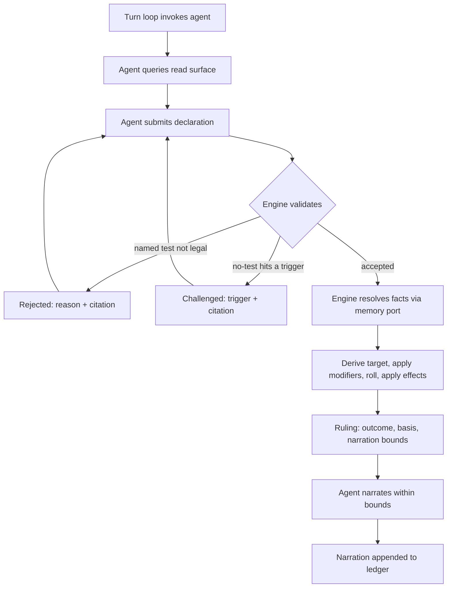

# SRD 5.2 Rules Engine

**The dungeon master interprets. The engine decides.**

An open-source Python library implementing the D&D **SRD 5.2 (2024 rules)** mechanics, built
so that an LLM agent running a game holds *interpretation* while the code holds **outcome
authority**. The agent decides **that** a rule applies and **which** one. It can never decide
**how it turns out**.

**Current build:** `08212026.2` — scaffolding and governance, plus a guard that keeps local-machine
details out of the repository. No engine code yet. `tests/test_build_stamp.py` fails CI when this
line drifts from `src/srd_rules_engine/__init__.py`, so it cannot go stale silently.

---

## The problem this solves

Running a solo session with an LLM as dungeon master fails in a specific way. The model
recognises a situation, skips straight to a narrated outcome, and the dice never enter the
conversation. It didn't compute a DC wrong. **It never invoked the mechanic at all.**

Moving the arithmetic somewhere trustworthy doesn't fix that. A correct dice function exposed
as a tool is a tool the model *may* call — and a model that doesn't realise a check is
warranted will not call it. The bug lives one step earlier, between "player describes an
action" and "outcome exists."

It has a second face. Once an outcome is narrated freely, consequences accumulate that no rule
ever resolved: a successful lockpick becomes a guard who heard nothing, an NPC who now trusts
you, a door that was unlocked all along. Each is an unrolled ruling presented as established
fact, and by next session they're indistinguishable from things the dice actually decided.

The cost is that no state in the campaign can be trusted, which makes continuity worthless
even when it's faithfully persisted. You can't ask *why* a result happened, because no record
exists of a decision having been made.

## How it works

1. **Read surface** — the agent asks the engine what's legal right now (available actions,
   movement remaining, castable spells, active conditions) instead of recalling 5e from
   training.
2. **Declaration** — the agent submits which test applies, *or* an explicit "no test needed,
   because X."
3. **Challenge** — a no-test claim that collides with an SRD-derived trigger comes back
   `challenged`, with the citation, and must be re-declared. The silent skip becomes a
   recorded exchange.
4. **Ruling** — one adjudication entry point is the only path to an outcome. It returns the
   roll, the seed, the target number *and its derivation*, applied effects, SRD citations, and
   **narration bounds** — what the agent may and may not claim happened.
5. **Memory port** — narrative facts carrying mechanical weight (attitude, knowledge,
   inspiration) arrive through a **typed** port. The engine never reads prose. A file-backed
   reference implementation ships, so a campaign runs standalone.
6. **Ledger** — every declaration, challenge, ruling, and narration appends. Anything replays
   from its seed to an identical outcome.



The core takes **no LLM dependency and no network dependency** — enforced by
`tests/test_core_has_no_runtime_dependencies.py`, not by good intentions. MCP, HTTP, and CLI
are adapters over the same contract, never the foundation.

## Scope of v1

Full SRD 5.2 mechanical coverage is the **definition of done**, not a stretch goal: the
unified d20 test (checks / saves / attacks as one primitive), combat (initiative, rounds,
action economy, AC, damage, criticals), movement in feet, the condition set, and spellcasting
(slots, concentration, save DCs, spell attacks).

Out of scope: multiplayer, any user interface, narrative generation, and the narrative memory
system itself. See **Non-goals** in [`AGENTS.md`](AGENTS.md) — those are declined, not
backlog.

## Status

**Requirements-only. Nothing built yet.**

[`docs/plans/2026-08-19-001-feat-srd-rules-engine-plan.md`](docs/plans/2026-08-19-001-feat-srd-rules-engine-plan.md)
carries 36 requirements, 4 flows, 5 acceptance examples, and 10 settled design decisions. Two
`ce-doc-review` rounds applied 24 findings; round 2 found none.

Open work lives in **[GitHub Issues](https://github.com/eddiefiggie/srd-rules-engine/issues)** —
the single source of truth. The plan's ten outstanding questions, its attribution dependency, and
its four deferred scope items are all filed there rather than left as prose, and the plan itself
carries the issue number beside each one.

| Milestone | What closes it |
|---|---|
| **M0 — Design gates settled** | Every [`gate`](https://github.com/eddiefiggie/srd-rules-engine/issues?q=is%3Aissue+is%3Aopen+label%3Agate) question answered and folded back into the plan. Nothing is implemented until this closes, because each open gate would otherwise be settled by whoever writes the code first. |
| **M1 — Playable vertical slice** | One character, one encounter, end to end. A development milestone, not a release. |
| **v1.0 — Full SRD 5.2 coverage** | Every entry in the effect-shape inventory ([#14](https://github.com/eddiefiggie/srd-rules-engine/issues/14)) resolves. Partial coverage is an incomplete release, not a smaller one. |

Settled design decisions live in [`docs/decisions/`](docs/decisions/). A gate closes by producing
one, and the plan is amended to match:

- [0001 — the agent seam](docs/decisions/0001-agent-seam.md) — the turn loop yields typed requests
  rather than calling the agent (closed [#4](https://github.com/eddiefiggie/srd-rules-engine/issues/4))
- [0002 — ledger durability](docs/decisions/0002-ledger-durability.md) — nothing escapes the engine
  before its record is durable (closed [#5](https://github.com/eddiefiggie/srd-rules-engine/issues/5))
- [0003 — seed and verification](docs/decisions/0003-seed-and-verification.md) — no community
  dataset seeds the mechanics, and the official SRD v5.2.1 is the only verification reference
  (closed [#6](https://github.com/eddiefiggie/srd-rules-engine/issues/6))
- [0004 — the trigger catalogue](docs/decisions/0004-trigger-catalogue.md) — the catalogue is data,
  and over-firing is a fidelity defect
  (closed [#7](https://github.com/eddiefiggie/srd-rules-engine/issues/7))

**Next up:** [#11](https://github.com/eddiefiggie/srd-rules-engine/issues/11), retry bounds for
challenged and rejected declarations — promoted by
[#7](https://github.com/eddiefiggie/srd-rules-engine/issues/7), which handed it a concrete case:
an over-firing trigger can produce a challenge the agent cannot satisfy, so retry bounds are what
stops a challenge loop. Then [#8](https://github.com/eddiefiggie/srd-rules-engine/issues/8),
[#9](https://github.com/eddiefiggie/srd-rules-engine/issues/9),
[#10](https://github.com/eddiefiggie/srd-rules-engine/issues/10),
[#12](https://github.com/eddiefiggie/srd-rules-engine/issues/12), and
[#13](https://github.com/eddiefiggie/srd-rules-engine/issues/13).
[#3](https://github.com/eddiefiggie/srd-rules-engine/issues/3) still gates all SRD-derived data,
and #6 made its target precise: the wording must come from **SRD v5.2.1** specifically. Then
`/ce-plan` to turn the requirements artifact into an implementation plan.

M1's machinery issues are deliberately **not** filed yet: the adjudication core, ledger, and memory
port would all be reshaped by the gates above, so filing them now would file the wrong work. The
coverage epics are filed, because the SRD defines those regardless of how the gates land.

## Development

```bash
python3 -m venv .venv && source .venv/bin/activate
pip install -e '.[dev]'
pytest && ruff check . && ruff format --check . && mypy
```

CI runs that same gate on every pull request across Python 3.11–3.13. See
[`CONTRIBUTING.md`](CONTRIBUTING.md) for the working agreement and
[`AGENTS.md`](AGENTS.md) for the standing rules an agent working in this repo must read first.

## Attribution

Mechanics derive from the **System Reference Document 5.2** by Wizards of the Coast, licensed
under **CC BY 4.0**. The engine's own code is **MIT**. Those are two different licences over
two different things — read [`NOTICE.md`](NOTICE.md) before landing any rules data. No
SRD-derived content has been committed yet, and the attribution wording must be verified
against the published document before the first entry lands.

---

## Resume prompt

> I'm resuming the **SRD 5.2 Rules Engine** (`eddiefiggie/srd-rules-engine`). It's an
> open-source Python library
> implementing D&D SRD 5.2 (2024) mechanics in full, where an LLM agent holds interpretation
> and the code holds outcome authority — the agent decides *that* a rule applies and *which*,
> never *how it turns out*.
>
> The architecture is an engine-driven loop, not agent-driven tool calls: a thick read surface
> tells the agent what's legal, the agent submits a declaration (or an explicit "no test
> needed, because X"), the engine can **challenge** a skip that collides with an SRD-derived
> trigger, and a single adjudication entry point is the only path to an outcome. Every Ruling
> carries the roll, seed, target derivation, SRD citations, and **narration bounds**.
> Narrative facts reach rules through a *typed* memory port — never prose — with a file-backed
> reference implementation shipped. Everything appends to a replayable ledger. The core has no
> LLM and no network dependency; MCP is an adapter, not the foundation.
>
> Solo play, one character. Full SRD 5.2 coverage including combat and spellcasting is the
> definition of done for v1.
>
> Read `AGENTS.md` first, then check open GitHub Issues (the single source of truth for open
> work — `gate`-labelled ones block implementation). The requirements artifact is
> `docs/plans/2026-08-19-001-feat-srd-rules-engine-plan.md`.

_Last updated: 2026-08-22 — build `08212026.2`._
