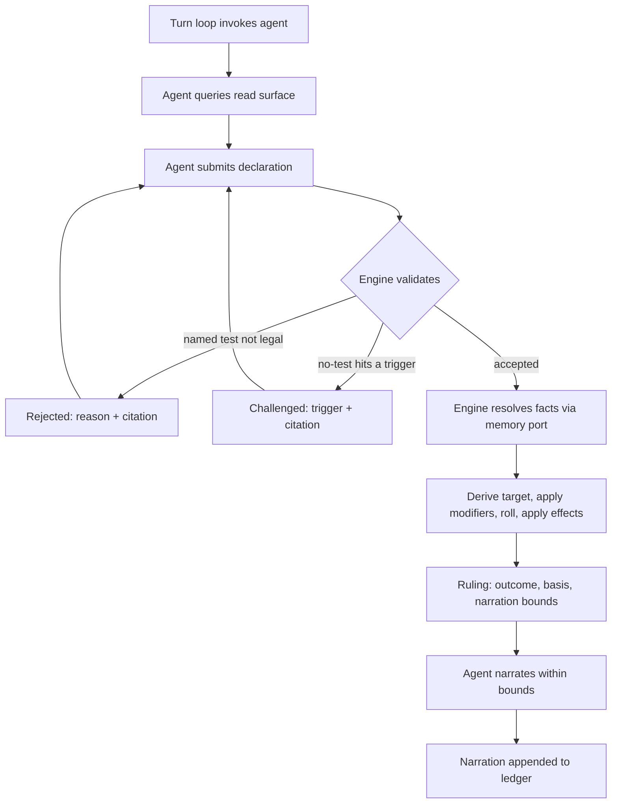

# SRD 5.2 Rules Engine

**The dungeon master interprets. The engine decides.**

An open-source Python library implementing the D&D **SRD 5.2 (2024 rules)** mechanics, built
so that an LLM agent running a game holds *interpretation* while the code holds **outcome
authority**. The agent decides **that** a rule applies and **which** one. It can never decide
**how it turns out**.

**Current build:** `08312026.12` — **a shape that was built and unclaimed, found by an audit rather than a build.** `instant-death` (p. 17) was `"implemented": false` while **two of its three clauses had been in `with_damage` since the death saves shipped** — with tests, and with both sentences already asserted in the verifier. The Massive Damage branch even carries the document's own worked example in its comments, explaining why the **remainder** is compared rather than the whole blow. Its third clause, *"A creature dies if its Hit Point maximum reaches 0"*, has **no antecedent** — nothing here reduces a maximum — which is the category that did not block `short-rest` either, as distinct from a clause whose antecedent exists and is unbuilt, which is why `long-rest` is still held by [#422](https://github.com/eddiefiggie/srd-rules-engine/issues/422). It is asserted anyway, so the distinction is checkable rather than argued. **This is the mirror direction, and it ran the harmless way**: `AGENTS.md` says no guard catches "is this clause built", and every previous instance was a shape claimed over an engine that had not built it — telling a reader a mechanic works when it does not. This told a reader less was modelled than is. Harmless to a player; **not harmless to planning**, since every "remaining" figure published since was one too large. It surfaced only because p. 184's Knocking Out needed to know whether a subduing blow can interact with Massive Damage, and reading `with_damage` to answer that showed the rule sitting there ([#426](https://github.com/eddiefiggie/srd-rules-engine/issues/426)). Nothing systematic was looking. 133 of 210, 14 clauses. 338 clauses verified against the document. 2239 tests.

---

## The problem this solves

Running a solo session with an LLM as dungeon master fails in a specific way. The model
recognises a situation, skips straight to a narrated outcome, and the dice never enter the
conversation. It didn't compute a DC wrong. **It never invoked the mechanic at all.**

Moving the arithmetic somewhere trustworthy doesn't fix that. A correct dice function exposed
as a tool is a tool the model *may* call — and a model that doesn't realise a check is
warranted will not call it. The bug lives one step earlier, between "player describes an
action" and "outcome exists."

It has a second face. Once an outcome is narrated freely, consequences accumulate that no rule
ever resolved: a successful lockpick becomes a guard who heard nothing, an NPC who now trusts
you, a door that was unlocked all along. Each is an unrolled ruling presented as established
fact, and by next session they're indistinguishable from things the dice actually decided.

The cost is that no state in the campaign can be trusted, which makes continuity worthless
even when it's faithfully persisted. You can't ask *why* a result happened, because no record
exists of a decision having been made.

## How it works

1. **Read surface** — the agent asks the engine what's legal right now (available actions,
   movement remaining, castable spells, active conditions) instead of recalling 5e from
   training.
2. **Declaration** — the agent submits which test applies, *or* an explicit "no test needed,
   because X."
3. **Challenge** — a no-test claim that collides with an SRD-derived trigger comes back
   `challenged`, with the citation, and must be re-declared. The silent skip becomes a
   recorded exchange.
4. **Ruling** — one adjudication entry point is the only path to an outcome. It returns the
   roll, the seed, the target number *and its derivation*, applied effects, SRD citations, and
   **narration bounds** — what the agent may and may not claim happened.
5. **Memory port** — narrative facts carrying mechanical weight (attitude, knowledge,
   inspiration) arrive through a **typed** port. The engine never reads prose. A file-backed
   reference implementation ships, so a campaign runs standalone.
6. **Ledger** — every declaration, challenge, ruling, and narration appends. Anything replays
   from its seed to an identical outcome.



The core takes **no LLM dependency and no network dependency** — enforced by
`tests/test_core_has_no_runtime_dependencies.py`, not by good intentions. MCP, HTTP, and CLI
are adapters over the same contract, never the foundation.

## Scope of v1

Full SRD 5.2 mechanical coverage is the **definition of done**, not a stretch goal: the
unified d20 test (checks / saves / attacks as one primitive), combat (initiative, rounds,
action economy, AC, damage, criticals), movement in feet, the condition set, and spellcasting
(slots, concentration, save DCs, spell attacks).

Out of scope: multiplayer, any user interface, narrative generation, and the narrative memory
system itself. See **Non-goals** in [`AGENTS.md`](AGENTS.md) — those are declined, not
backlog.

## Status

**The vertical slice runs: one character, one encounter, end to end, with no model and no
network.**

[`docs/plans/2026-08-19-001-feat-srd-rules-engine-plan.md`](docs/plans/2026-08-19-001-feat-srd-rules-engine-plan.md)
carries 36 requirements, 4 flows, 5 acceptance examples, and the fourteen implementation units
behind them. All fourteen exist. `tests/test_vertical_slice.py` asserts the slice **through its
session-review report** rather than through intermediate states — every unit's own tests were
green while the report was silently mis-flagging an answered challenge, which is exactly the
failure a per-step assertion cannot see.

**What a green suite here does not prove.** The slice runs a scripted driver, which asserts
exactly what it is told to and therefore cannot produce an unprompted silent skip. It shows the
report *detects* each defect condition when one is injected. It does not show that a live agent
*cannot evade* it — and [#42](https://github.com/eddiefiggie/srd-rules-engine/issues/42) went
looking, found that one can, and closed having **narrowed** the criterion rather than met it.
What a clean report does not establish is now named on the report itself
(`Report.not_measured`, [#197](https://github.com/eddiefiggie/srd-rules-engine/issues/197)).
The half still unanswered is **recall** — whether an agent that has never read this repository
skips in the first place — and it is
[#403](https://github.com/eddiefiggie/srd-rules-engine/issues/403). Reading the slice as having
met the contract's bar is the misreading this milestone most invites.

Open work lives in **[GitHub Issues](https://github.com/eddiefiggie/srd-rules-engine/issues)** —
the single source of truth. The plan's outstanding questions, its attribution dependency, and its
deferred scope items are all filed there rather than left as prose, and the plan itself carries
the issue number beside each one.

| Milestone | Where it stands |
|---|---|
| **M0 — Design gates settled** | **Closed.** Every [`gate`](https://github.com/eddiefiggie/srd-rules-engine/issues?q=is%3Aissue+label%3Agate) question was answered and folded back into the plan, producing 23 records in [`docs/decisions/`](docs/decisions/). None is open. A gate closing does **not** mean its design is built: each record's **Status of implementation** says which clauses are, and an unbuilt one now carries an issue of its own ([#126](https://github.com/eddiefiggie/srd-rules-engine/issues/126)). |
| **M1 — Playable vertical slice** | **Demonstrated; the criterion is half answered and the answered half was uncomfortable.** The encounter runs end to end and the report flags every defect condition it is shown. [#42](https://github.com/eddiefiggie/srd-rules-engine/issues/42) drove a live session and split the criterion in two. **Evasion** is settled and settled badly: `tests/test_skip_guarantee.py` narrates a kill over a recorded miss and the report comes back clean, because `Flag.NARRATION_WITHOUT_RULING` measures that every narration *has* a Ruling, never that it stays inside one. R7 makes the bounds advisory by design — the engine named the exact claim in that ruling's bounds and did not enforce it — so this is the instrument's limit rather than a defect, and `Report.not_measured` now says so on every report ([#197](https://github.com/eddiefiggie/srd-rules-engine/issues/197)). **Recall** — does an agent skip when nobody has shown it where the challenges are? — cannot be answered from inside, because an agent that has read this trigger catalogue is the wrong instrument. It is [#403](https://github.com/eddiefiggie/srd-rules-engine/issues/403), and it is the primary criterion; nothing else here substitutes for it. |
| **v1.0 — mechanics** | **133 of 210 effect shapes.** Every entry in the inventory ([#14](https://github.com/eddiefiggie/srd-rules-engine/issues/14)) must resolve. Conditions are 15/15 and the d20 test 11/12. **Both figures have fallen, and no capability was lost either time.** `save` went first-to-mind as coverage and was never a second thing: p. 187 says it is another name for a saving throw, and `ENGINE_SHAPES` already resolved both ids to `core.d20.TestKind.SAVE` — one mechanic counted twice in the numerator *and* the denominator, so removing it makes the figure more true rather than smaller ([0035](docs/decisions/0035-two-names-for-one-thing-are-one-shape.md), [#230](https://github.com/eddiefiggie/srd-rules-engine/issues/230)). The denominator fell once before because `weapon-attack` stopped being counted, not because a shape was deleted: SRD 5.2 defines *Weapon Attack* on p. 191 and never uses the term again, so it renames `attack-roll` with a parameter fixed and gates nothing ([0034](docs/decisions/0034-a-term-the-document-defines-and-never-uses.md), [#229](https://github.com/eddiefiggie/srd-rules-engine/issues/229)). Weapon properties are **10 of 10**, and the count said nine-of-nine for forty-five builds because p. 89-90 defines **ten** properties while the inventory carried nine ([#316](https://github.com/eddiefiggie/srd-rules-engine/issues/316), [0046](docs/decisions/0046-a-default-and-the-rule-that-says-otherwise-are-two-shapes.md)). Reach was folded into p. 186's glossary entry on the reasoning that the Glossary already defines it — true of the *term*, false of the *mechanic*, because p. 186 gives the 5-foot default "unless a rule says otherwise" and p. 90 is the rule that says otherwise. One flag claimed two rules over an engine that had built one, so a reader asking whether Reach weapons worked was told yes while a Glaive was never offered a target at 10 feet. The last two of the original nine waited on things nobody expected: Loading on `multiattack` rather than on Light ([#271](https://github.com/eddiefiggie/srd-rules-engine/issues/271)), and Ammunition on deciding a count is a fact about the creature ([#273](https://github.com/eddiefiggie/srd-rules-engine/issues/273), [0044](docs/decisions/0044-a-quantity-is-a-fact-about-the-creature.md)). p. 89's post-fight recovery shipped with them ([#301](https://github.com/eddiefiggie/srd-rules-engine/issues/301)), and what it discloses is not an unbuilt rule but an accepted claim: p. 14 ends combat on five conditions and the engine can observe two, so the agent's word that the fight is over is taken rather than checked, and the ruling's narration bounds say so ([0044](docs/decisions/0044-a-quantity-is-a-fact-about-the-creature.md) clause 5). Inferring from the observable half would end fights early and hand back arrows on the engine's own authority. Weapon masteries are **8 of 8**, and the last one took three records to reach: p. 90 gates all eight on a feature the wielder has ([0047](docs/decisions/0047-a-mastery-property-is-unlocked-by-the-wielder.md)), and Graze had shipped ungated. Nick joined it by re-routing p. 89's extra attack into the Attack action ([#320](https://github.com/eddiefiggie/srd-rules-engine/issues/320)), and Topple by generalising 0036's Concentration-shaped save queue into one that serves any compelled save ([0048](docs/decisions/0048-a-forced-save-is-one-mechanism.md), [#321](https://github.com/eddiefiggie/srd-rules-engine/issues/321)). Vex and Sap landed together because they are one mechanism reversed on all four axes — sign, holder, scope, and which end of a turn it dies at ([0049](docs/decisions/0049-advantage-that-outlives-its-roll.md), [#318](https://github.com/eddiefiggie/srd-rules-engine/issues/318), [#319](https://github.com/eddiefiggie/srd-rules-engine/issues/319)). [#324](https://github.com/eddiefiggie/srd-rules-engine/issues/324)'s **Push** was last and was blocked twice over: on a `Size` nothing carried ([0051](docs/decisions/0051-a-size-is-stated-or-it-is-unknown.md)) and on forced movement, which is shared with a dozen other rules and needed a gate of its own ([0055](docs/decisions/0055-a-creature-moved-by-something-other-than-itself.md), [#349](https://github.com/eddiefiggie/srd-rules-engine/issues/349)). Senses and light are **7 of 10**. Lightly Obscured and Dim Light resolved together, because they were one blockage: p. 184's Disadvantage was produced by nothing, so p. 181's classification into it was computed and read by nobody. Bright Light joined them once #228 asked whether an entry that states no mechanic can ever be claimed: its mechanic is on **p. 11**, not in its glossary entry, and the engine already produced it. The three that remain each state something nothing consumes — Truesight's third piercing, Tremorsense's pinpointing, and Telepathy's languages ([0025](docs/decisions/0025-sight-is-a-relation-over-stored-state.md), [0033](docs/decisions/0033-a-glossary-entry-is-an-index-not-a-shapes-boundary.md), [#138](https://github.com/eddiefiggie/srd-rules-engine/issues/138), [#166](https://github.com/eddiefiggie/srd-rules-engine/issues/166)). |
| **v1.0 — content** | **Six monsters, no spells.** `data/` holds the effect-shape inventory and six stat blocks ([#99](https://github.com/eddiefiggie/srd-rules-engine/issues/99)). Spell Descriptions is 0/11 shapes, so no SRD spell can currently be cast. Tracked as [#21](https://github.com/eddiefiggie/srd-rules-engine/issues/21). |
| **v1.0 — adapters** | **All three R34 names ship.** MCP behind the `mcp` extra; CLI and HTTP need no dependency at all, so `[project].dependencies` stays empty (R33). One shared guard holds all three: no adapter reaches adjudication, and none waives an end-of-turn obligation. Every declared command now works — `supply_facts` was declared and raising on all three until [#144](https://github.com/eddiefiggie/srd-rules-engine/issues/144). Neither CLI nor HTTP has an executable — a console script must pick a ruleset, and there is not yet one to play. |
| **SRD fidelity** | **No open gap.** A downed player character now makes death saves: p. 17 puts the save at the **start** of a turn, and the turn's start is a phase this engine has ([#124](https://github.com/eddiefiggie/srd-rules-engine/issues/124), [0027](docs/decisions/0027-occasions-and-outcomes-without-a-roll.md)). `MAX_SPELL_LEVEL`'s provenance closed with [#130](https://github.com/eddiefiggie/srd-rules-engine/issues/130). The remaining known-wrong behaviour is narrow and disclosed: Falling applies Prone when Resistance rounds the damage to zero ([#173](https://github.com/eddiefiggie/srd-rules-engine/issues/173)). |

**What the shape counter does not count, and why the number can stand still while work lands.**
The inventory measures *resolved effect shapes*, so building a **route** moves nothing. Two landed
recently and both were structural: a condition can now be applied or ended only through a ruling
([#119](https://github.com/eddiefiggie/srd-rules-engine/issues/119)), and the end of a turn is a
phase the loop owns rather than something a caller must remember to drive
([#110](https://github.com/eddiefiggie/srd-rules-engine/issues/110)). Before them, every condition
in the engine arrived by a caller reaching past the adjudicator, and a save the engine reported as
due was never rolled. Neither shows up as a shape, and reading 76 as "unchanged, so nothing
happened" is the misreading this table most invites.

#110 also narrowed a limitation this project ships disclosed. "The skip guarantee holds only for
callers the turn loop drives" still holds, but `advanced_turn` now **refuses** while an end-of-turn
save is owed, so a caller the loop does drive can no longer skip one by forgetting.

## Effect-shape coverage

`src/srd_rules_engine/data/effect_shapes.json` is the measuring stick R17 requires: the
distinct effect shapes SRD v5.2.1 defines, each marked implemented or not. Without it,
"full SRD 5.2 coverage is the definition of done" is unfalsifiable — there is no way to
tell a complete engine from one whose author stopped noticing gaps.

**133 of 210 shapes resolve today.** The other 77 are listed, not omitted; run
`python -c "from srd_rules_engine.core import coverage_report; print(coverage_report())"`
to see exactly which. Entries sit at independently-failable granularity, so each of the
fifteen conditions counts separately — an engine that resolves Prone and nothing else
reports 1/15 rather than reporting conditions done.

**14 clauses are disclosed but unenforced**, and that is the instrument's second figure
([0061](docs/decisions/0061-a-shape-resolves-and-a-clause-may-not.md)). A shape can resolve
while a *sentence* of it reaches no roll: `frightened` was implemented for forty builds while
"you can't willingly move closer to the source of fear" was enforced by nothing. Coverage
counts shapes and cannot see that, so `unenforced_clauses` counts the sentences and this
publishes the total. **It is the one figure that improves by going down** — five consecutive
builds reduced it while `116 of 210` did not move once.

Enumeration is mechanical: `scripts/derive_effect_shapes.py` reads the Rules Glossary's
155 entry headings straight off the official PDF, so nothing in the list is recalled from
memory. Classification — which entries are effect shapes and which merely define a term —
is editorial and lives in that script where it can be reviewed. Twenty-two entries are
recorded as vocabulary with a stated reason rather than dropped.

The script is **not** in CI, because CI has no copy of the document. Anyone holding the PDF can
run it with `--check` to confirm the shipped inventory is still what the document says, without
overwriting it. What *is* in CI is the half that needs no document: every one of its ten sweep
tables must hold rows of the arity its own sweep unpacks, which is the structural claim that
broke in [#373](https://github.com/eddiefiggie/srd-rules-engine/issues/373) and took the
instrument down for a day.

**All eleven rules sections of the document are swept**, and that claim is asserted rather
than described: `test_every_section_of_the_document_is_represented` compares the sections the
shapes cite against the document's table of contents, and `unswept_sections` — now empty —
must agree with it. The prose version of this claim was wrong for eight builds, and its first
repair would have passed for the wrong reason, which is why it is data with a guard now.

Complete coverage of the document is **not** the same as a correct inventory. The granularity
and consolidation questions raised across the sweeps are tracked separately.

Settled design decisions live in [`docs/decisions/`](docs/decisions/). A gate closes by producing
one, and the plan is amended to match. **Every record is listed**, and the list is generated
from the records themselves by `scripts/render_record_index.py` — a hand-written one stopped at
0022 and read as complete for nineteen records ([#282](https://github.com/eddiefiggie/srd-rules-engine/issues/282)):

<!-- record-index: generated by scripts/render_record_index.py -->
- [0001 — The agent seam is a generator of typed requests](docs/decisions/0001-agent-seam.md) — settles [#4](https://github.com/eddiefiggie/srd-rules-engine/issues/4)
- [0002 — Nothing escapes the engine before its record is durable](docs/decisions/0002-ledger-durability.md) — settles [#5](https://github.com/eddiefiggie/srd-rules-engine/issues/5)
- [0003 — No structured seed for mechanics; the official SRD 5.2.1 is the verification reference](docs/decisions/0003-seed-and-verification.md) — settles [#6](https://github.com/eddiefiggie/srd-rules-engine/issues/6)
- [0004 — The trigger catalogue is data, and over-firing is a fidelity defect](docs/decisions/0004-trigger-catalogue.md) — settles [#7](https://github.com/eddiefiggie/srd-rules-engine/issues/7)
- [0005 — Retry bounds belong to the turn loop, and exhaustion is not a rules outcome](docs/decisions/0005-retry-bounds.md) — settles [#11](https://github.com/eddiefiggie/srd-rules-engine/issues/11)
- [0006 — JSONL with a fixed envelope, and a reader API rather than a public file format](docs/decisions/0006-ledger-format.md) — settles [#10](https://github.com/eddiefiggie/srd-rules-engine/issues/10)
- [0007 — Read tokens make the alternatives claim checkable without touching R19](docs/decisions/0007-alternatives-verification.md) — settles [#8](https://github.com/eddiefiggie/srd-rules-engine/issues/8)
- [0008 — Reverse-DNS extension namespaces that no engine rule may consume](docs/decisions/0008-extension-channel.md) — settles [#9](https://github.com/eddiefiggie/srd-rules-engine/issues/9)
- [0009 — The reference memory store is flat JSON, because it is a projection of the ledger](docs/decisions/0009-reference-memory-store.md) — settles [#12](https://github.com/eddiefiggie/srd-rules-engine/issues/12)
- [0010 — A block is a suspension, and the loop bounds itself](docs/decisions/0010-blocked-loop.md) — settles [#33](https://github.com/eddiefiggie/srd-rules-engine/issues/33)
- [0011 — Layer boundaries are a guard test, and schemas carry a min-reader floor](docs/decisions/0011-module-layout-and-versioning.md) — settles [#13](https://github.com/eddiefiggie/srd-rules-engine/issues/13)
- [0012 — Provenance selects the entry point, not a branch inside one](docs/decisions/0012-fixture-provenance.md) — settles [#41](https://github.com/eddiefiggie/srd-rules-engine/issues/41)
- [0013 — The effect-shape vocabulary normalises on mechanism, not on the feature that exhibits it](docs/decisions/0013-effect-shape-normalisation.md) — settles [#76](https://github.com/eddiefiggie/srd-rules-engine/issues/76)
- [0014 — Position is three integer coordinates in feet, and distance is never a float](docs/decisions/0014-positional-state.md) — settles [#17](https://github.com/eddiefiggie/srd-rules-engine/issues/17), [#20](https://github.com/eddiefiggie/srd-rules-engine/issues/20)
- [0015 — The generator seam already serves reactions; what they need is state and triggers](docs/decisions/0015-reactions-and-the-agent-seam.md) — settles [#4](https://github.com/eddiefiggie/srd-rules-engine/issues/4), [#16](https://github.com/eddiefiggie/srd-rules-engine/issues/16)
- [0016 — An adapter holds the suspended turn, and never exposes adjudication](docs/decisions/0016-adapters-hold-the-turn.md) — settles [#97](https://github.com/eddiefiggie/srd-rules-engine/issues/97)
- [0017 — Verification is a pattern asserted against the document, and it does not cover modelling](docs/decisions/0017-verification-is-asserted-not-read.md) — settles [#21](https://github.com/eddiefiggie/srd-rules-engine/issues/21)
- [0018 — Three stability tiers, an integer API version, and a committed surface that is enumerated](docs/decisions/0018-api-stability.md) — settles [#39](https://github.com/eddiefiggie/srd-rules-engine/issues/39)
- [0019 — `kind` is a filing label, not a model, and stays one axis](docs/decisions/0019-kind-is-a-filing-label.md) — settles [#84](https://github.com/eddiefiggie/srd-rules-engine/issues/84)
- [0020 — Two kinds of time, minutes as the unit, and the round-to-clock bridge left unbuilt](docs/decisions/0020-two-kinds-of-time.md) — settles [#85](https://github.com/eddiefiggie/srd-rules-engine/issues/85)
- [0021 — A round is exactly six seconds, and the clock still does not advance itself](docs/decisions/0021-a-round-is-six-seconds.md) — settles [#108](https://github.com/eddiefiggie/srd-rules-engine/issues/108)
- [0022 — `compat` is a reader version, and no payload derives it from its own schema version](docs/decisions/0022-compat-is-a-reader-version.md) — settles [#106](https://github.com/eddiefiggie/srd-rules-engine/issues/106)
- [0023 — The turn's end is a loop-owned phase, and an early-out is two mechanisms rather than one](docs/decisions/0023-the-turns-end-is-a-loop-owned-phase.md) — settles [#110](https://github.com/eddiefiggie/srd-rules-engine/issues/110)
- [0024 — the README's build line is the build record, and `CHANGELOG.md` is retired](docs/decisions/0024-the-build-line-is-the-build-record.md) — settles [#146](https://github.com/eddiefiggie/srd-rules-engine/issues/146)
- [0025 — sight is a relation derived over stored state, and the mapping that resolves it ships empty](docs/decisions/0025-sight-is-a-relation-over-stored-state.md) — settles [#138](https://github.com/eddiefiggie/srd-rules-engine/issues/138)
- [0026 — Terrain enters by one route, and it is state](docs/decisions/0026-terrain-enters-as-state.md) — settles [#151](https://github.com/eddiefiggie/srd-rules-engine/issues/151)
- [0027 — The turn's start is a phase too, and not every outcome rolls a d20](docs/decisions/0027-occasions-and-outcomes-without-a-roll.md) — settles [#124](https://github.com/eddiefiggie/srd-rules-engine/issues/124), [#140](https://github.com/eddiefiggie/srd-rules-engine/issues/140)
- [0028 — An Exhaustion level carries the rule that caused it](docs/decisions/0028-a-level-carries-the-rule-that-caused-it.md) — settles [#180](https://github.com/eddiefiggie/srd-rules-engine/issues/180)
- [0029 — Whether a wall blocks sight is a property of the wall](docs/decisions/0029-whether-a-wall-blocks-sight-is-a-property-of-the-wall.md) — settles [#188](https://github.com/eddiefiggie/srd-rules-engine/issues/188)
- [0030 — An unanswerable qualifier resolves in the direction that cannot invent an outcome](docs/decisions/0030-an-unanswerable-qualifier-resolves-away-from-invention.md) — settles [#190](https://github.com/eddiefiggie/srd-rules-engine/issues/190)
- [0031 — Two printed rules that disagree state no rule, and 0030's tiebreak must not be reached for them](docs/decisions/0031-a-contradiction-in-the-document-is-an-absent-rule.md) — settles [#182](https://github.com/eddiefiggie/srd-rules-engine/issues/182), [#205](https://github.com/eddiefiggie/srd-rules-engine/issues/205)
- [0032 — An effect may be conditional on what a sibling effect turned out to be, and the only honest place to ask is where the damage settles](docs/decisions/0032-an-outcome-conditional-on-its-own-damage.md) — settles [#173](https://github.com/eddiefiggie/srd-rules-engine/issues/173)
- [0033 — A glossary entry is an index into the rules, not the boundary of one](docs/decisions/0033-a-glossary-entry-is-an-index-not-a-shapes-boundary.md) — settles [#228](https://github.com/eddiefiggie/srd-rules-engine/issues/228)
- [0034 — A term the document defines and never uses is vocabulary](docs/decisions/0034-a-term-the-document-defines-and-never-uses.md) — settles [#229](https://github.com/eddiefiggie/srd-rules-engine/issues/229)
- [0035 — Two names for one thing are one shape](docs/decisions/0035-two-names-for-one-thing-are-one-shape.md) — settles [#230](https://github.com/eddiefiggie/srd-rules-engine/issues/230)
- [0036 — A fourth occasion, owed by whoever took the damage](docs/decisions/0036-a-fourth-occasion-owed-by-whoever-took-the-damage.md) — settles [#215](https://github.com/eddiefiggie/srd-rules-engine/issues/215)
- [0037 — A concentration is an early-out, not an axis](docs/decisions/0037-a-concentration-is-an-early-out-not-an-axis.md) — settles [#239](https://github.com/eddiefiggie/srd-rules-engine/issues/239)
- [0038 — A spell is data the caster carries, and the engine spends what casting costs](docs/decisions/0038-a-spell-is-data-the-caster-carries.md) — settles [#244](https://github.com/eddiefiggie/srd-rules-engine/issues/244)
- [0039 — Equipment is what a creature holds, wears and carries](docs/decisions/0039-equipment-is-what-a-creature-holds-wears-and-carries.md) — settles [#256](https://github.com/eddiefiggie/srd-rules-engine/issues/256)
- [0040 — A weapon is an item, and proficiency is the wielder's](docs/decisions/0040-a-weapon-is-an-item-and-proficiency-is-the-wielders.md) — settles [#262](https://github.com/eddiefiggie/srd-rules-engine/issues/262)
- [0041 — An item that leaves a creature is an object, and where it lands is unstated](docs/decisions/0041-an-item-that-leaves-a-creature-is-an-object-somewhere-unstated.md) — settles [#265](https://github.com/eddiefiggie/srd-rules-engine/issues/265), [#272](https://github.com/eddiefiggie/srd-rules-engine/issues/272)
- [0042 — Equipping rides on the attack that permits it, and the second interaction is unmodelled](docs/decisions/0042-equipping-rides-on-the-attack-that-permits-it.md) — settles [#283](https://github.com/eddiefiggie/srd-rules-engine/issues/283)
- [0043 — One action, several attacks, and one swap](docs/decisions/0043-one-action-several-attacks-and-one-swap.md) — settles [#289](https://github.com/eddiefiggie/srd-rules-engine/issues/289)
- [0044 — A quantity is a fact about the creature, not about the item](docs/decisions/0044-a-quantity-is-a-fact-about-the-creature.md) — settles [#273](https://github.com/eddiefiggie/srd-rules-engine/issues/273)
- [0045 — One object interaction a turn, and the Action buys more](docs/decisions/0045-one-object-interaction-a-turn-and-the-action-buys-more.md) — settles [#288](https://github.com/eddiefiggie/srd-rules-engine/issues/288)
- [0046 — A default and the rule that says otherwise are two shapes](docs/decisions/0046-a-default-and-the-rule-that-says-otherwise-are-two-shapes.md) — settles [#316](https://github.com/eddiefiggie/srd-rules-engine/issues/316)
- [0047 — A mastery property is unlocked by the wielder](docs/decisions/0047-a-mastery-property-is-unlocked-by-the-wielder.md) — settles [#317](https://github.com/eddiefiggie/srd-rules-engine/issues/317)
- [0048 — A forced save is one mechanism, whatever compelled it](docs/decisions/0048-a-forced-save-is-one-mechanism.md) — settles [#321](https://github.com/eddiefiggie/srd-rules-engine/issues/321)
- [0049 — Advantage that outlives its roll](docs/decisions/0049-advantage-that-outlives-its-roll.md) — settles [#318](https://github.com/eddiefiggie/srd-rules-engine/issues/318), [#319](https://github.com/eddiefiggie/srd-rules-engine/issues/319)
- [0050 — A turn boundary is shared and a mechanism is not](docs/decisions/0050-a-turn-boundary-is-shared-and-a-mechanism-is-not.md) — settles [#322](https://github.com/eddiefiggie/srd-rules-engine/issues/322)
- [0051 — A size is stated, or it is unknown](docs/decisions/0051-a-size-is-stated-or-it-is-unknown.md) — settles [#259](https://github.com/eddiefiggie/srd-rules-engine/issues/259)
- [0052 — The exit is built before the entrance](docs/decisions/0052-the-exit-is-built-before-the-entrance.md) — settles [#335](https://github.com/eddiefiggie/srd-rules-engine/issues/335)
- [0053 — The target chooses, and the engine rolls](docs/decisions/0053-the-target-chooses-and-the-engine-rolls.md) — settles [#335](https://github.com/eddiefiggie/srd-rules-engine/issues/335), [#343](https://github.com/eddiefiggie/srd-rules-engine/issues/343)
- [0054 — A save is rolled by a creature](docs/decisions/0054-a-save-is-rolled-by-a-creature.md) — settles [#344](https://github.com/eddiefiggie/srd-rules-engine/issues/344)
- [0055 — A creature moved by something other than itself](docs/decisions/0055-a-creature-moved-by-something-other-than-itself.md) — settles [#324](https://github.com/eddiefiggie/srd-rules-engine/issues/324), [#345](https://github.com/eddiefiggie/srd-rules-engine/issues/345), [#349](https://github.com/eddiefiggie/srd-rules-engine/issues/349)
- [0056 — A move is refused where it is made](docs/decisions/0056-a-move-is-refused-where-it-is-made.md) — settles [#350](https://github.com/eddiefiggie/srd-rules-engine/issues/350)
- [0057 — Prone crawls or stands, and both were built together](docs/decisions/0057-prone-crawls-or-stands.md) — settles [#353](https://github.com/eddiefiggie/srd-rules-engine/issues/353)
- [0058 — A field nothing reads is a rule modelled and not applied](docs/decisions/0058-a-field-nothing-reads-is-a-rule-not-applied.md) — settles [#357](https://github.com/eddiefiggie/srd-rules-engine/issues/357)
- [0059 — Initiative draws a pair for everyone](docs/decisions/0059-initiative-draws-a-pair-for-everyone.md) — settles [#359](https://github.com/eddiefiggie/srd-rules-engine/issues/359)
- [0060 — A disclosure can be wrong about why](docs/decisions/0060-a-disclosure-can-be-wrong-about-why.md) — settles [#360](https://github.com/eddiefiggie/srd-rules-engine/issues/360)
- [0061 — A shape resolves, and a clause may not](docs/decisions/0061-a-shape-resolves-and-a-clause-may-not.md) — settles [#356](https://github.com/eddiefiggie/srd-rules-engine/issues/356)
- [0062 — The menu is not a promise](docs/decisions/0062-the-menu-is-not-a-promise.md) — settles [#245](https://github.com/eddiefiggie/srd-rules-engine/issues/245)
- [0063 — Training is a legality rule, and it is by item id](docs/decisions/0063-training-is-a-legality-rule.md) — settles [#247](https://github.com/eddiefiggie/srd-rules-engine/issues/247)
- [0064 — Any D20 Test, not any saving throw](docs/decisions/0064-any-d20-test-not-any-saving-throw.md) — settles [#367](https://github.com/eddiefiggie/srd-rules-engine/issues/367)
- [0065 — A long cast spends its slot on completion](docs/decisions/0065-a-long-cast-spends-its-slot-on-completion.md) — settles [#250](https://github.com/eddiefiggie/srd-rules-engine/issues/250)
- [0066 — A move that brings someone with it](docs/decisions/0066-a-move-that-brings-someone-with-it.md) — settles [#340](https://github.com/eddiefiggie/srd-rules-engine/issues/340)
- [0067 — p. 178's cap needed an antecedent, and stating it is the permission](docs/decisions/0067-p-178s-cap-needed-an-antecedent.md) — settles [#336](https://github.com/eddiefiggie/srd-rules-engine/issues/336)
- [0068 — A rule the menu asks and nothing else does](docs/decisions/0068-a-rule-the-menu-asks-and-nothing-else-does.md) — settles [#365](https://github.com/eddiefiggie/srd-rules-engine/issues/365)
- [0069 — The attack path asks what the menu asks](docs/decisions/0069-the-attack-path-asks-what-the-menu-asks.md) — settles [#376](https://github.com/eddiefiggie/srd-rules-engine/issues/376)
- [0070 — An instrument that cannot notice its own staleness](docs/decisions/0070-an-instrument-that-cannot-notice-its-own-staleness.md) — settles [#373](https://github.com/eddiefiggie/srd-rules-engine/issues/373)
- [0071 — A blocker that closed, and a disclosure that did not notice](docs/decisions/0071-a-blocker-that-closed-and-a-disclosure-that-did-not-notice.md) — settles [#381](https://github.com/eddiefiggie/srd-rules-engine/issues/381)
- [0072 — Movement is a phase the loop drives](docs/decisions/0072-movement-is-a-phase-the-loop-drives.md) — settles [#382](https://github.com/eddiefiggie/srd-rules-engine/issues/382)
- [0073 — A slot records the turn it happened in](docs/decisions/0073-a-slot-records-the-turn-it-happened-in.md) — settles [#120](https://github.com/eddiefiggie/srd-rules-engine/issues/120)
- [0074 — A Ritual is a long casting](docs/decisions/0074-a-ritual-is-a-long-casting.md) — settles [#371](https://github.com/eddiefiggie/srd-rules-engine/issues/371)
- [0075 — Ties are a person's, and Initiative is a Dexterity check](docs/decisions/0075-ties-are-a-persons-and-initiative-is-a-dexterity-check.md) — settles [#385](https://github.com/eddiefiggie/srd-rules-engine/issues/385)
- [0076 — Improvised is a use, not an object](docs/decisions/0076-improvised-is-a-use-not-an-object.md) — settles [#264](https://github.com/eddiefiggie/srd-rules-engine/issues/264)
- [0077 — Armour Class is a chosen base, plus bonuses](docs/decisions/0077-armour-class-is-a-chosen-base-and-bonuses.md) — settles [#380](https://github.com/eddiefiggie/srd-rules-engine/issues/380)
- [0078 — The last armour-training drawback](docs/decisions/0078-the-last-armour-training-drawback.md) — settles [#367](https://github.com/eddiefiggie/srd-rules-engine/issues/367)
- [0079 — A second base refuses rather than being picked between](docs/decisions/0079-a-second-base-refuses-rather-than-being-picked-between.md) — settles [#394](https://github.com/eddiefiggie/srd-rules-engine/issues/394)
- [0080 — Dehydration is bookkeeping, and Malnutrition is two rules](docs/decisions/0080-dehydration-is-bookkeeping.md) — settles [#315](https://github.com/eddiefiggie/srd-rules-engine/issues/315)
- [0081 — A campaign day's end is the fifth occasion](docs/decisions/0081-a-campaign-days-end-is-the-fifth-occasion.md) — settles [#399](https://github.com/eddiefiggie/srd-rules-engine/issues/399)
- [0082 — A Short Rest is an offer repeated until the caller stops](docs/decisions/0082-a-short-rest-is-an-offer-repeated.md) — settles [#406](https://github.com/eddiefiggie/srd-rules-engine/issues/406)
<!-- /record-index -->

**Next up:** [#250](https://github.com/eddiefiggie/srd-rules-engine/issues/250) — longer casting times, where the Magic action is taken each
turn and a break refunds nothing because nothing was spent. Then [#253](https://github.com/eddiefiggie/srd-rules-engine/issues/253), the
Magic action's feature-and-item half. [#246](https://github.com/eddiefiggie/srd-rules-engine/issues/246) and [#247](https://github.com/eddiefiggie/srd-rules-engine/issues/247) stay blocked on
subsystems that do not exist, and are disclosed rather than skipped.

## Development

```bash
python3 -m venv .venv && source .venv/bin/activate
pip install -e '.[dev]'
pytest && ruff check . && ruff format --check . && mypy
```

CI runs that same gate on every pull request across Python 3.11–3.13. See
[`CONTRIBUTING.md`](CONTRIBUTING.md) for the working agreement and
[`AGENTS.md`](AGENTS.md) for the standing rules an agent working in this repo must read first.

## Attribution

Mechanics derive from the **System Reference Document 5.2** by Wizards of the Coast, licensed
under **CC BY 4.0**. The engine's own code is **MIT**. Those are two different licences over
two different things — read [`NOTICE.md`](NOTICE.md) before landing any rules data. The
attribution statement there is transcribed from the published document's front matter rather
than reconstructed, and the first SRD-derived content has landed: six monsters, statistics only
([#99](https://github.com/eddiefiggie/srd-rules-engine/issues/99)). Each entry carries its own
verification state, and the loader refuses anything `unverified` — a seed is never a source.

---

## Resume prompt

> I'm resuming the **SRD 5.2 Rules Engine** (`eddiefiggie/srd-rules-engine`). It's an
> open-source Python library
> implementing D&D SRD 5.2 (2024) mechanics in full, where an LLM agent holds interpretation
> and the code holds outcome authority — the agent decides *that* a rule applies and *which*,
> never *how it turns out*.
>
> The architecture is an engine-driven loop, not agent-driven tool calls: a thick read surface
> tells the agent what's legal, the agent submits a declaration (or an explicit "no test
> needed, because X"), the engine can **challenge** a skip that collides with an SRD-derived
> trigger, and a single adjudication entry point is the only path to an outcome. Every Ruling
> carries the roll, seed, target derivation, SRD citations, and **narration bounds**.
> Narrative facts reach rules through a *typed* memory port — never prose — with a file-backed
> reference implementation shipped. Everything appends to a replayable ledger. The core has no
> LLM and no network dependency; MCP is an adapter, not the foundation.
>
> Solo play, one character. Full SRD 5.2 coverage including combat and spellcasting is the
> definition of done for v1.
>
> Read `AGENTS.md` first, then check open GitHub Issues (the single source of truth for open
> work — `gate`-labelled ones block implementation). The requirements artifact is
> `docs/plans/2026-08-19-001-feat-srd-rules-engine-plan.md`.

_Last updated: 2026-08-31 — build `08312026.12`._
