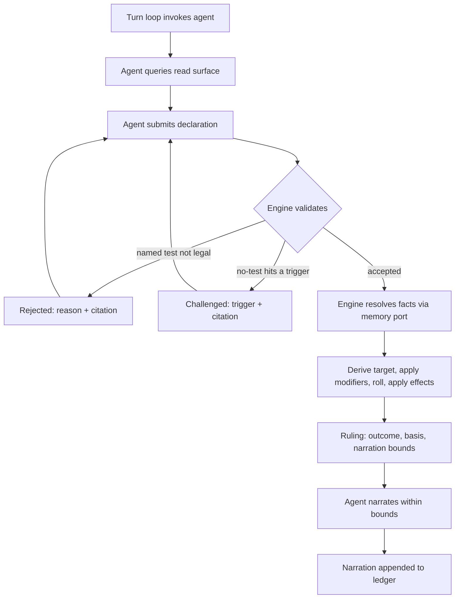

# SRD 5.2 Rules Engine

**The dungeon master interprets. The engine decides.**

An open-source Python library implementing the D&D **SRD 5.2 (2024 rules)** mechanics, built
so that an LLM agent running a game holds *interpretation* while the code holds **outcome
authority**. The agent decides **that** a rule applies and **which** one. It can never decide
**how it turns out**.

**Current build:** `08242026.6` — **every verification block swept after #129, and the sweep found one real gap and corrected the guard that suggested it.** `DURATION_VERIFICATION` did not name p. 63, the page `SaveEnds` is built from — same shape as #129, check already asserted, so the citation is added and the date stays. The sweep's other finding is filed rather than fixed: `MAX_SPELL_LEVEL = 9` transcribes p. 26 and **p. 26 is verified nowhere** — not in a block, not in the verifier — so unlike #129 the check does not exist and cannot be written without the document ([#130](https://github.com/eddiefiggie/srd-rules-engine/issues/130)). The rest of what the sweep flagged is not a defect and is recorded so a later audit does not re-raise it: cross-module citations, page-range artifacts, and illustrative references. That also **corrects a suggestion made in #126** — #129's per-module guard must not be generalised, because a module legitimately cites pages verified where the rule lives; applied to `core.combat` it would raise four false alarms at once. 915 tests.

---

## The problem this solves

Running a solo session with an LLM as dungeon master fails in a specific way. The model
recognises a situation, skips straight to a narrated outcome, and the dice never enter the
conversation. It didn't compute a DC wrong. **It never invoked the mechanic at all.**

Moving the arithmetic somewhere trustworthy doesn't fix that. A correct dice function exposed
as a tool is a tool the model *may* call — and a model that doesn't realise a check is
warranted will not call it. The bug lives one step earlier, between "player describes an
action" and "outcome exists."

It has a second face. Once an outcome is narrated freely, consequences accumulate that no rule
ever resolved: a successful lockpick becomes a guard who heard nothing, an NPC who now trusts
you, a door that was unlocked all along. Each is an unrolled ruling presented as established
fact, and by next session they're indistinguishable from things the dice actually decided.

The cost is that no state in the campaign can be trusted, which makes continuity worthless
even when it's faithfully persisted. You can't ask *why* a result happened, because no record
exists of a decision having been made.

## How it works

1. **Read surface** — the agent asks the engine what's legal right now (available actions,
   movement remaining, castable spells, active conditions) instead of recalling 5e from
   training.
2. **Declaration** — the agent submits which test applies, *or* an explicit "no test needed,
   because X."
3. **Challenge** — a no-test claim that collides with an SRD-derived trigger comes back
   `challenged`, with the citation, and must be re-declared. The silent skip becomes a
   recorded exchange.
4. **Ruling** — one adjudication entry point is the only path to an outcome. It returns the
   roll, the seed, the target number *and its derivation*, applied effects, SRD citations, and
   **narration bounds** — what the agent may and may not claim happened.
5. **Memory port** — narrative facts carrying mechanical weight (attitude, knowledge,
   inspiration) arrive through a **typed** port. The engine never reads prose. A file-backed
   reference implementation ships, so a campaign runs standalone.
6. **Ledger** — every declaration, challenge, ruling, and narration appends. Anything replays
   from its seed to an identical outcome.



The core takes **no LLM dependency and no network dependency** — enforced by
`tests/test_core_has_no_runtime_dependencies.py`, not by good intentions. MCP, HTTP, and CLI
are adapters over the same contract, never the foundation.

## Scope of v1

Full SRD 5.2 mechanical coverage is the **definition of done**, not a stretch goal: the
unified d20 test (checks / saves / attacks as one primitive), combat (initiative, rounds,
action economy, AC, damage, criticals), movement in feet, the condition set, and spellcasting
(slots, concentration, save DCs, spell attacks).

Out of scope: multiplayer, any user interface, narrative generation, and the narrative memory
system itself. See **Non-goals** in [`AGENTS.md`](AGENTS.md) — those are declined, not
backlog.

## Status

**The vertical slice runs: one character, one encounter, end to end, with no model and no
network.**

[`docs/plans/2026-08-19-001-feat-srd-rules-engine-plan.md`](docs/plans/2026-08-19-001-feat-srd-rules-engine-plan.md)
carries 36 requirements, 4 flows, 5 acceptance examples, and the fourteen implementation units
behind them. All fourteen exist. `tests/test_vertical_slice.py` asserts the slice **through its
session-review report** rather than through intermediate states — every unit's own tests were
green while the report was silently mis-flagging an answered challenge, which is exactly the
failure a per-step assertion cannot see.

**What a green suite here does not prove.** The slice runs a scripted driver, which asserts
exactly what it is told to and therefore cannot produce an unprompted silent skip. It shows the
report *detects* each defect condition when one is injected. It does not show that a live agent
*cannot evade* it — that is the product contract's primary criterion, it needs a real model, and
it is filed as [#42](https://github.com/eddiefiggie/srd-rules-engine/issues/42). Reading the
slice as having met the contract's bar is the misreading this milestone most invites.

Open work lives in **[GitHub Issues](https://github.com/eddiefiggie/srd-rules-engine/issues)** —
the single source of truth. The plan's outstanding questions, its attribution dependency, and its
deferred scope items are all filed there rather than left as prose, and the plan itself carries
the issue number beside each one.

| Milestone | Where it stands |
|---|---|
| **M0 — Design gates settled** | **Closed.** Every [`gate`](https://github.com/eddiefiggie/srd-rules-engine/issues?q=is%3Aissue+label%3Agate) question was answered and folded back into the plan, each producing a record in [`docs/decisions/`](docs/decisions/). None is open. |
| **M1 — Playable vertical slice** | **Demonstrated, not validated.** The encounter runs end to end and the report flags every defect condition it is shown. The live-agent half is [#42](https://github.com/eddiefiggie/srd-rules-engine/issues/42) and is still open. |
| **v1.0 — Full SRD 5.2 coverage** | **76 of 211 effect shapes.** Every entry in the inventory ([#14](https://github.com/eddiefiggie/srd-rules-engine/issues/14)) must resolve. Partial coverage is an incomplete release, not a smaller one. |

## Effect-shape coverage

`src/srd_rules_engine/data/effect_shapes.json` is the measuring stick R17 requires: the
distinct effect shapes SRD v5.2.1 defines, each marked implemented or not. Without it,
"full SRD 5.2 coverage is the definition of done" is unfalsifiable — there is no way to
tell a complete engine from one whose author stopped noticing gaps.

**76 of 211 shapes resolve today.** The other 135 are listed, not omitted; run
`python -c "from srd_rules_engine.core import coverage_report; print(coverage_report())"`
to see exactly which. Entries sit at independently-failable granularity, so each of the
fifteen conditions counts separately — an engine that resolves Prone and nothing else
reports 1/15 rather than reporting conditions done.

Enumeration is mechanical: `scripts/derive_effect_shapes.py` reads the Rules Glossary's
155 entry headings straight off the official PDF, so nothing in the list is recalled from
memory. Classification — which entries are effect shapes and which merely define a term —
is editorial and lives in that script where it can be reviewed. Twenty entries are
recorded as vocabulary with a stated reason rather than dropped.

**All eleven rules sections of the document are swept**, and that claim is asserted rather
than described: `test_every_section_of_the_document_is_represented` compares the sections the
shapes cite against the document's table of contents, and `unswept_sections` — now empty —
must agree with it. The prose version of this claim was wrong for eight builds, and its first
repair would have passed for the wrong reason, which is why it is data with a guard now.

Complete coverage of the document is **not** the same as a correct inventory. The granularity
and consolidation questions raised across the sweeps are tracked separately.

Settled design decisions live in [`docs/decisions/`](docs/decisions/). A gate closes by producing
one, and the plan is amended to match:

- [0001 — the agent seam](docs/decisions/0001-agent-seam.md) — the turn loop yields typed requests
  rather than calling the agent (closed [#4](https://github.com/eddiefiggie/srd-rules-engine/issues/4))
- [0002 — ledger durability](docs/decisions/0002-ledger-durability.md) — nothing escapes the engine
  before its record is durable (closed [#5](https://github.com/eddiefiggie/srd-rules-engine/issues/5))
- [0003 — seed and verification](docs/decisions/0003-seed-and-verification.md) — no community
  dataset seeds the mechanics, and the official SRD v5.2.1 is the only verification reference
  (closed [#6](https://github.com/eddiefiggie/srd-rules-engine/issues/6))
- [0004 — the trigger catalogue](docs/decisions/0004-trigger-catalogue.md) — the catalogue is data,
  and over-firing is a fidelity defect
  (closed [#7](https://github.com/eddiefiggie/srd-rules-engine/issues/7))
- [0005 — retry bounds](docs/decisions/0005-retry-bounds.md) — bounds belong to the turn loop, and
  exhaustion is a terminal outcome rather than a rules status
  (closed [#11](https://github.com/eddiefiggie/srd-rules-engine/issues/11))
- [0006 — ledger format](docs/decisions/0006-ledger-format.md) — JSONL with a fixed envelope, and a
  reader API rather than a public file format
  (closed [#10](https://github.com/eddiefiggie/srd-rules-engine/issues/10))
- [0007 — alternatives verification](docs/decisions/0007-alternatives-verification.md) — read tokens
  make the agent's claim checkable without relaxing R19
  (closed [#8](https://github.com/eddiefiggie/srd-rules-engine/issues/8))
- [0008 — the extension channel](docs/decisions/0008-extension-channel.md) — reverse-DNS namespaces
  that no engine rule may consume
  (closed [#9](https://github.com/eddiefiggie/srd-rules-engine/issues/9))
- [0009 — the reference memory store](docs/decisions/0009-reference-memory-store.md) — flat JSON,
  because the store is a projection of the ledger
  (closed [#12](https://github.com/eddiefiggie/srd-rules-engine/issues/12))
- [0010 — the blocked loop](docs/decisions/0010-blocked-loop.md) — a block is a suspension, and the
  loop bounds itself
  (closed [#33](https://github.com/eddiefiggie/srd-rules-engine/issues/33))
- [0011 — layout and versioning](docs/decisions/0011-module-layout-and-versioning.md) — layer
  boundaries are a guard test, and schemas carry a min-reader floor
  (closed [#13](https://github.com/eddiefiggie/srd-rules-engine/issues/13))
- [0012 — fixture provenance](docs/decisions/0012-fixture-provenance.md) — provenance selects the
  entry point, not a branch inside one
  (closed [#41](https://github.com/eddiefiggie/srd-rules-engine/issues/41))
- [0013 — effect-shape normalisation](docs/decisions/0013-effect-shape-normalisation.md) — the
  vocabulary normalises on mechanism, not on the feature that exhibits it
  (closed [#76](https://github.com/eddiefiggie/srd-rules-engine/issues/76))
- [0014 — positional state](docs/decisions/0014-positional-state.md) — position is three integer
  coordinates in feet, and distance is never a float
  (settles the positional model for [#17](https://github.com/eddiefiggie/srd-rules-engine/issues/17) and [#20](https://github.com/eddiefiggie/srd-rules-engine/issues/20))
- [0015 — reactions and the agent seam](docs/decisions/0015-reactions-and-the-agent-seam.md) — the
  generator seam already serves reactions; what they need is state and triggers
  (settles the architectural question [#16](https://github.com/eddiefiggie/srd-rules-engine/issues/16) raised)
- [0016 — adapters hold the turn](docs/decisions/0016-adapters-hold-the-turn.md) — an adapter holds
  the suspended turn, and never exposes adjudication
  (settles the adapter shape for [#97](https://github.com/eddiefiggie/srd-rules-engine/issues/97))
- [0017 — verification is asserted, not read](docs/decisions/0017-verification-is-asserted-not-read.md)
  — verification is a pattern asserted against the document, and it does not cover modelling
  (supersedes [0003](docs/decisions/0003-seed-and-verification.md) in part)
- [0018 — API stability](docs/decisions/0018-api-stability.md) — three stability tiers, an integer
  API version, and a committed surface that is enumerated
  (closed [#39](https://github.com/eddiefiggie/srd-rules-engine/issues/39))
- [0019 — `kind` is a filing label](docs/decisions/0019-kind-is-a-filing-label.md) — a filing label,
  not a model, and it stays one axis
  (closed [#84](https://github.com/eddiefiggie/srd-rules-engine/issues/84))
- [0020 — two kinds of time](docs/decisions/0020-two-kinds-of-time.md) — the encounter axis and the
  campaign clock, and a turn never advances the clock
  (closed [#85](https://github.com/eddiefiggie/srd-rules-engine/issues/85))
- [0021 — a round is six seconds](docs/decisions/0021-a-round-is-six-seconds.md) — the document does
  print the conversion (p. 98), which amends 0020's first clause
  (closed [#108](https://github.com/eddiefiggie/srd-rules-engine/issues/108))
- [0022 — `compat` is a reader version](docs/decisions/0022-compat-is-a-reader-version.md) — no
  payload derives `compat` from its own schema version
  (closed [#106](https://github.com/eddiefiggie/srd-rules-engine/issues/106))

**Next up:** [#124](https://github.com/eddiefiggie/srd-rules-engine/issues/124) — the death
save is the other half of the phase #110 built, and it is blocked on the document rather than
on design: `core.death` cites pp. 17-18 for what a death saving throw *is* and never states
when it is made. Wiring it on the assumption that it shares p. 63's timing would be inferring a
rule value, so the sentence has to be found and asserted first.

## Development

```bash
python3 -m venv .venv && source .venv/bin/activate
pip install -e '.[dev]'
pytest && ruff check . && ruff format --check . && mypy
```

CI runs that same gate on every pull request across Python 3.11–3.13. See
[`CONTRIBUTING.md`](CONTRIBUTING.md) for the working agreement and
[`AGENTS.md`](AGENTS.md) for the standing rules an agent working in this repo must read first.

## Attribution

Mechanics derive from the **System Reference Document 5.2** by Wizards of the Coast, licensed
under **CC BY 4.0**. The engine's own code is **MIT**. Those are two different licences over
two different things — read [`NOTICE.md`](NOTICE.md) before landing any rules data. The
attribution statement there is transcribed from the published document's front matter rather
than reconstructed, and the first SRD-derived content has landed: six monsters, statistics only
([#99](https://github.com/eddiefiggie/srd-rules-engine/issues/99)). Each entry carries its own
verification state, and the loader refuses anything `unverified` — a seed is never a source.

---

## Resume prompt

> I'm resuming the **SRD 5.2 Rules Engine** (`eddiefiggie/srd-rules-engine`). It's an
> open-source Python library
> implementing D&D SRD 5.2 (2024) mechanics in full, where an LLM agent holds interpretation
> and the code holds outcome authority — the agent decides *that* a rule applies and *which*,
> never *how it turns out*.
>
> The architecture is an engine-driven loop, not agent-driven tool calls: a thick read surface
> tells the agent what's legal, the agent submits a declaration (or an explicit "no test
> needed, because X"), the engine can **challenge** a skip that collides with an SRD-derived
> trigger, and a single adjudication entry point is the only path to an outcome. Every Ruling
> carries the roll, seed, target derivation, SRD citations, and **narration bounds**.
> Narrative facts reach rules through a *typed* memory port — never prose — with a file-backed
> reference implementation shipped. Everything appends to a replayable ledger. The core has no
> LLM and no network dependency; MCP is an adapter, not the foundation.
>
> Solo play, one character. Full SRD 5.2 coverage including combat and spellcasting is the
> definition of done for v1.
>
> Read `AGENTS.md` first, then check open GitHub Issues (the single source of truth for open
> work — `gate`-labelled ones block implementation). The requirements artifact is
> `docs/plans/2026-08-19-001-feat-srd-rules-engine-plan.md`.

_Last updated: 2026-08-24 — build `08242026.6`._
