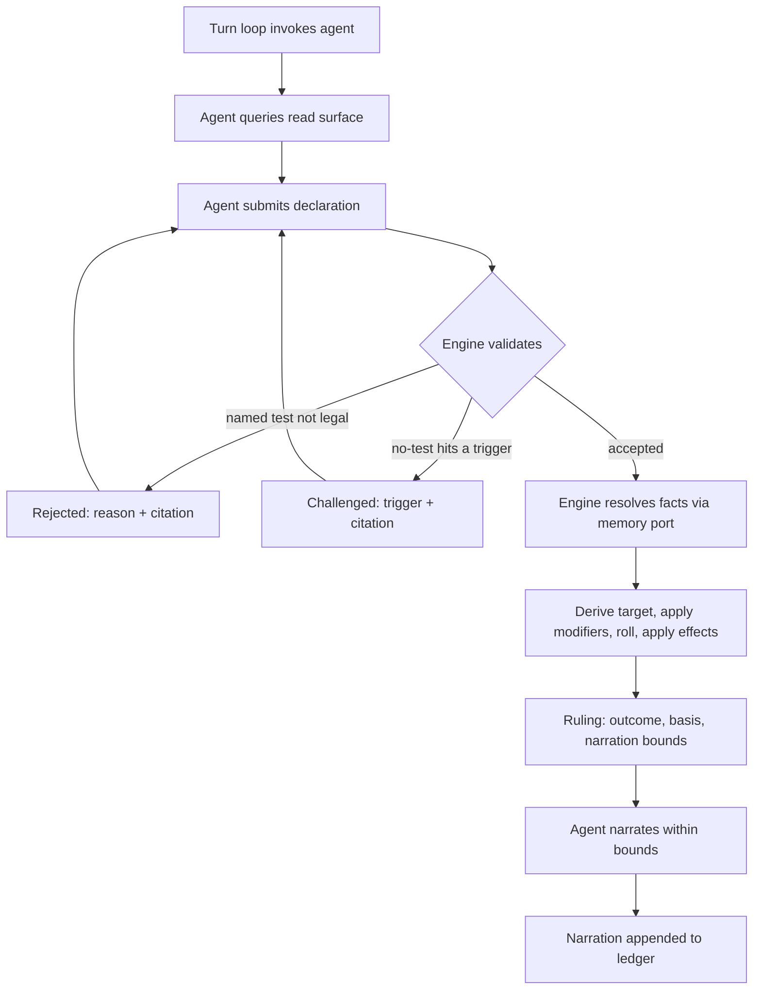

# SRD 5.2 Rules Engine

**The dungeon master interprets. The engine decides.**

An open-source Python library implementing the D&D **SRD 5.2 (2024 rules)** mechanics, built
so that an LLM agent running a game holds *interpretation* while the code holds **outcome
authority**. The agent decides **that** a rule applies and **which** one. It can never decide
**how it turns out**.

**Current build:** `08212026.1` — scaffolding and governance. No engine code yet.
`tests/test_build_stamp.py` fails CI when this line drifts from `src/srd_rules_engine/__init__.py`,
so it cannot go stale silently.

**Category:** Personal

---

## The problem this solves

Running a solo session with an LLM as dungeon master fails in a specific way. The model
recognises a situation, skips straight to a narrated outcome, and the dice never enter the
conversation. It didn't compute a DC wrong. **It never invoked the mechanic at all.**

Moving the arithmetic somewhere trustworthy doesn't fix that. A correct dice function exposed
as a tool is a tool the model *may* call — and a model that doesn't realise a check is
warranted will not call it. The bug lives one step earlier, between "player describes an
action" and "outcome exists."

It has a second face. Once an outcome is narrated freely, consequences accumulate that no rule
ever resolved: a successful lockpick becomes a guard who heard nothing, an NPC who now trusts
you, a door that was unlocked all along. Each is an unrolled ruling presented as established
fact, and by next session they're indistinguishable from things the dice actually decided.

The cost is that no state in the campaign can be trusted, which makes continuity worthless
even when it's faithfully persisted. You can't ask *why* a result happened, because no record
exists of a decision having been made.

## How it works

1. **Read surface** — the agent asks the engine what's legal right now (available actions,
   movement remaining, castable spells, active conditions) instead of recalling 5e from
   training.
2. **Declaration** — the agent submits which test applies, *or* an explicit "no test needed,
   because X."
3. **Challenge** — a no-test claim that collides with an SRD-derived trigger comes back
   `challenged`, with the citation, and must be re-declared. The silent skip becomes a
   recorded exchange.
4. **Ruling** — one adjudication entry point is the only path to an outcome. It returns the
   roll, the seed, the target number *and its derivation*, applied effects, SRD citations, and
   **narration bounds** — what the agent may and may not claim happened.
5. **Memory port** — narrative facts carrying mechanical weight (attitude, knowledge,
   inspiration) arrive through a **typed** port. The engine never reads prose. A file-backed
   reference implementation ships, so a campaign runs standalone.
6. **Ledger** — every declaration, challenge, ruling, and narration appends. Anything replays
   from its seed to an identical outcome.



The core takes **no LLM dependency and no network dependency** — enforced by
`tests/test_core_has_no_runtime_dependencies.py`, not by good intentions. MCP, HTTP, and CLI
are adapters over the same contract, never the foundation.

## Scope of v1

Full SRD 5.2 mechanical coverage is the **definition of done**, not a stretch goal: the
unified d20 test (checks / saves / attacks as one primitive), combat (initiative, rounds,
action economy, AC, damage, criticals), movement in feet, the condition set, and spellcasting
(slots, concentration, save DCs, spell attacks).

Out of scope: multiplayer, any user interface, narrative generation, and the narrative memory
system itself. See **Non-goals** in [`AGENTS.md`](AGENTS.md) — those are declined, not
backlog.

## Status

**Requirements-only. Nothing built yet.**

[`docs/plans/2026-08-19-001-feat-srd-rules-engine-plan.md`](docs/plans/2026-08-19-001-feat-srd-rules-engine-plan.md)
carries 36 requirements, 4 flows, 5 acceptance examples, and 10 settled design decisions. Two
`ce-doc-review` rounds applied 24 findings; round 2 found none.

Open work lives in **[GitHub Issues](https://github.com/eddiefiggie/srd-rules-engine/issues)** —
the single source of truth. The plan's eleven deferred questions and four deferred scope items
are filed there rather than left as prose. Design questions that gate implementation carry the
[`gate`](https://github.com/eddiefiggie/srd-rules-engine/issues?q=is%3Aissue+is%3Aopen+label%3Agate)
label; self-deferred work carries [`backlog`](https://github.com/eddiefiggie/srd-rules-engine/issues?q=is%3Aissue+is%3Aopen+label%3Abacklog).

**Next up:** settle the gate issues — the seed dataset and its per-entry verification record,
the agent-invocation seam, and whether a ledger append precedes returning a Ruling — then
`/ce-plan` to turn the requirements artifact into an implementation plan.

## Development

```bash
python3 -m venv .venv && source .venv/bin/activate
pip install -e '.[dev]'
pytest && ruff check . && mypy
```

CI runs that same gate on every pull request across Python 3.11–3.13. See
[`CONTRIBUTING.md`](CONTRIBUTING.md) for the working agreement and
[`AGENTS.md`](AGENTS.md) for the standing rules an agent working in this repo must read first.

## Attribution

Mechanics derive from the **System Reference Document 5.2** by Wizards of the Coast, licensed
under **CC BY 4.0**. The engine's own code is **MIT**. Those are two different licences over
two different things — read [`NOTICE.md`](NOTICE.md) before landing any rules data. No
SRD-derived content has been committed yet, and the attribution wording must be verified
against the published document before the first entry lands.

---

## Resume prompt

> I'm resuming the **SRD 5.2 Rules Engine** at `~/ClaudeGarage/personal/srd-rules-engine/`
> (public repo: `eddiefiggie/srd-rules-engine`). It's an open-source Python library
> implementing D&D SRD 5.2 (2024) mechanics in full, where an LLM agent holds interpretation
> and the code holds outcome authority — the agent decides *that* a rule applies and *which*,
> never *how it turns out*.
>
> The architecture is an engine-driven loop, not agent-driven tool calls: a thick read surface
> tells the agent what's legal, the agent submits a declaration (or an explicit "no test
> needed, because X"), the engine can **challenge** a skip that collides with an SRD-derived
> trigger, and a single adjudication entry point is the only path to an outcome. Every Ruling
> carries the roll, seed, target derivation, SRD citations, and **narration bounds**.
> Narrative facts reach rules through a *typed* memory port — never prose — with a file-backed
> reference implementation shipped. Everything appends to a replayable ledger. The core has no
> LLM and no network dependency; MCP is an adapter, not the foundation.
>
> Solo play, one character. Full SRD 5.2 coverage including combat and spellcasting is the
> definition of done for v1.
>
> Read `AGENTS.md` first, then check open GitHub Issues (the single source of truth for open
> work — `gate`-labelled ones block implementation). The requirements artifact is
> `docs/plans/2026-08-19-001-feat-srd-rules-engine-plan.md`.

_Last updated: 2026-08-21 — build `08212026.1`._
