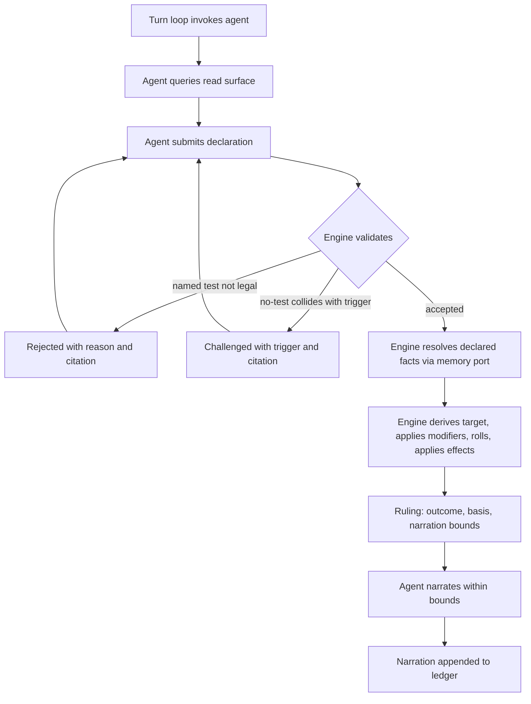
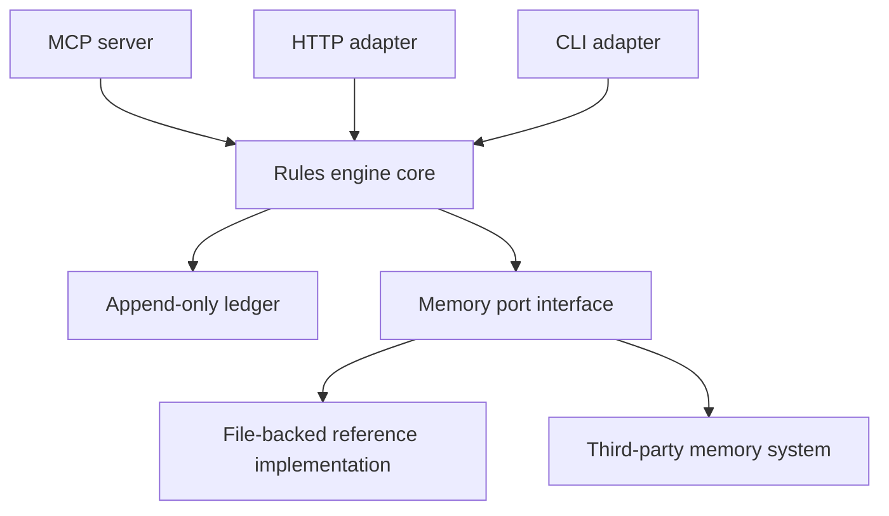

# SRD 5.2 Rules Engine - Plan

## Goal Capsule

- **Objective:** An open-source Python library that implements the SRD 5.2 mechanics in full and holds outcome authority, so that any LLM agent acting as a dungeon master can interpret fiction but cannot invent results.
- **Product authority:** This Product Contract. The SRD 5.2 (2024 rules), published by Wizards of the Coast under CC BY 4.0, is the authoritative source for every mechanic.
- **Open blockers:** None blocking planning. The official SRD 5.2 document is required as the verification reference for the sourced dataset; obtaining it is a planning task, not a gate on the mechanics code.

---

## Product Contract

### Summary

A Python library implementing the SRD 5.2 mechanics in full, where the agent holds interpretation and the code holds outcome authority. An agent queries a read surface to learn what is legal, submits a declaration of which test applies or that none does, and receives a Ruling carrying the roll, the arithmetic, the SRD citations, and the bounds on what it may claim happened. Narrative facts that change rulings arrive through a typed port the engine owns but does not implement, and a turn-driving loop ships alongside the core, invoking the agent at defined points and forming what the adapters expose.

### Problem Frame

Running solo sessions with an LLM as dungeon master fails in a specific way: the model recognises a situation, skips straight to a narrated outcome, and the dice never enter the conversation. It did not compute a DC incorrectly. It never invoked the mechanic at all.

That defect is not fixed by moving arithmetic somewhere trustworthy. A correct dice function exposed as a tool is a tool the model may call, and a model that does not realise a check is warranted will not call it. The bug lives one step earlier, between "player describes an action" and "outcome exists."

The failure has a second face. Once an outcome is narrated freely, consequences accumulate that were never resolved by any rule — a successful lockpick becomes a guard who heard nothing, an NPC who now trusts you, a door that was unlocked all along. Each is an unrolled ruling presented as established fact, and by the next session they are indistinguishable from things the dice actually decided.

The cost is that no state in the campaign can be trusted, which makes continuity worthless even when it is technically persisted. There is no way to ask why a result happened, because no record exists of a decision having been made.

### Key Decisions

- **Engine-driven loop over agent-driven tool calls.** A Python loop owns the turn; the agent is invoked narrowly and never holds outcome authority. This is the only shape that makes inventing an outcome impossible rather than discouraged. The skip guarantee holds for callers the loop drives; a consumer that calls adjudication directly gets outcome authority without skip prevention. (session-settled: user-directed — chosen over tool-gated narration and a whole-turn referee pass: both leave the model deciding whether a rule was invoked.)

- **The agent seam is a generator of typed requests, not a callback.** The turn loop yields an `AgentRequest` and the driver sends back an `AgentResponse`; an object-shaped `Agent` adapter ships on top for the common case. Control inversion means one rules implementation serves synchronous, asynchronous, scripted, and human drivers — a callback shape would need a second async loop whose rules logic measured 100% duplicated (25 of 25 statements identical after stripping `await`), and a divergence between the two would be a rules bug visible only to async consumers. The seam is also the session transcript, so replay (R28) and the session-review report (R30) derive from it without the agent's cooperation. Reference bindings ship, and neither is an LLM: a scripted agent for tests and a CLI where the human answers, so v1 is playable with no model and no network. (session-settled: user-approved — chosen over a callback Protocol, a caller-pumped queue, and a subclass hook; see `docs/decisions/0001-agent-seam.md`.)

- **The engine can challenge a no-test declaration.** Triggers let the engine reject a claim that no check is needed and force re-adjudication. The silent skip is the observed defect, so it gets a deterministic guard rather than passive logging. Beyond the SRD's explicitly mechanical triggers — forced saves, attacks, stated hazards — the catalogue is project-authored, because the SRD leaves most of "does this need a check" to judgment. The catalogue is therefore known-incomplete, and its scope ships disclosed in the same way excluded mechanics are. (session-settled: user-directed — chosen over logging skips passively or having a second model review them: a model reviewing a model reintroduces the judgment being removed.)

- **The catalogue is data, and over-firing is a fidelity defect.** A trigger is a declarative row over a closed operator set, not a predicate, and the matcher never receives the declaration's free-text label — so R6 holds by construction rather than by review. Grounding is two-valued, `cited` or `authored`, because a tier assigned by judgment at intake stops carrying information. A report becomes an entry only after it is proven red, in both directions: a miss must first be shown not to challenge, and a false positive is narrowed by adding a condition rather than deleted. A wrongly-fired trigger makes the engine roll for something the SRD never called for, which is the project's defining defect with the sign flipped, so false positives carry `srd-fidelity`. Catalogue growth doubles as the recall instrument no other mechanism supplies: re-running closed ledgers against the current catalogue names every past session where a skip went through. (session-settled: user-approved — chosen over registered predicates, a predicate escape hatch, three grounding tiers, review-based admission, and two schemes for closing the improvised-intent gap; see `docs/decisions/0004-trigger-catalogue.md`.)

- **Retry bounds belong to the turn loop, and the engine never breaks a loop by choosing a test.** One budget per declaration slot covers challenges and rejections together, because the two interleave and any rule splitting them is arbitrary; two structurally identical refusals terminate at once, because a repeat proves the feedback is not being used — and under the trigger catalogue that usually means an over-broad row rather than a confused agent. Exhaustion is a terminal turn outcome, not a rules status: no rule says a badly-declared action has a result. Having the engine pick a legal default was rejected as a **bypass** — it would let an agent reach an adjudicated outcome by failing, putting a second path beside the declaration the agent is accountable for, and leaving R10 nothing to review. (session-settled: user-approved — chosen over separate budgets per status, an engine-selected default, unconditionally ending the turn, and bounds of 2 and 5; see `docs/decisions/0005-retry-bounds.md`.)

- **The agent decides *that* a rule applies and *which*; it can never decide *how it turns out*.** Nothing deterministic can read freeform prose and know a check is warranted, so classification stays with the agent. Only outcome authority is structurally closable, and closing it is the whole design.

- **Full SRD 5.2 mechanical coverage in v1, including combat and spellcasting.** The ability check, the saving throw, and the attack roll are one primitive with shared advantage, proficiency, and modifier machinery. Scoping to checks alone would build a third of that primitive and retrofit the rest. (session-settled: user-directed — chosen over a checks-first slice with combat deferred: slicing the d20 test means retrofitting two thirds of it.)

- **SRD 5.2 (2024 rules) as the modelled edition.** (session-settled: user-directed — chosen over SRD 5.1 and over a 5.2-rules/5.1-data hybrid: 5.1 has a decade of machine-readable community data, but it is not the edition being played.)

- **Thick read surface.** The engine answers what a character can legally do right now rather than only judging declarations after the fact. An agent choosing from engine-supplied options misclassifies less than one recalling from training, and orientation is what makes the engine useful to somebody else's agent. (session-settled: user-directed — chosen over a judgment-only surface and over deferring orientation to v2: the latter changes the public contract after release.)

- **Narrative memory lives outside the engine behind a typed port.** If the engine consumed prose it would be interpreting narrative again, which is the capability being removed. The port returns typed mechanical values only, and v1 ships a file-backed reference implementation so a real campaign runs without a second system existing first. (session-settled: user-directed — chosen over building memory inside the engine and over shipping a port with no implementation: the first pulls a large second system into v1, the second leaves v1 unplayable.)

- **MCP is a delivery surface, not the foundation.** MCP exists to expose tools to an agent that decides when to call them, which is the seam being closed. The core is a plain typed library with no LLM dependency; MCP, HTTP, and CLI are adapters over the same contract. Open-sourcing makes this load-bearing rather than merely tidy, since consumers will want different transports. (session-settled: user-approved — chosen over building on MCP from the start: an adapter over a clean library is cheap to add, while a protocol-first core bakes in the model's discretion.)

- **Nothing escapes the engine before its record is durable.** A Ruling, challenge, or rejection is not returned until its ledger entry is committed — one synchronising write per adjudication, at the escape boundary rather than at the roll. An outcome that never left the engine is not lost; the only bad state is one that reached the caller with no durable trace, which is the original defect arriving through the back door. This costs nothing over the unsafe option: R5 already requires the Ruling to carry seed, resolved facts and target derivation, which is exactly R28's replay input set, so one record buys both the outcome and its verifiability. Entries are hash-chained — not to defend a solo campaign against its own owner, but because a torn tail record is genuinely reachable and because #10 may make this the session interchange format, where retrofitting a chain is expensive. (session-settled: user-approved — chosen over append-after and over writing determinants separately before the roll; see `docs/decisions/0002-ledger-durability.md`.)

- **Rulings bound what the narrator may claim.** A Ruling states not only what happened but what the caller may and may not assert happened, so unresolved consequences must be declared separately rather than appended to a successful roll. (session-settled: user-approved — chosen over returning outcome data alone: without bounds, free-associated consequences reproduce the original defect downstream of a correct roll.)

- **Mechanics are modelled by hand from the official SRD 5.2.1, with no community dataset as a seed.** Verification state — `unverified` / `verified` / `excluded`, with the reference section, the date, and a reason on an exclusion — lives alongside each entry, and only `verified` entries reach the engine. This costs a human read of the document per mechanic, and buys a provenance chain with no unnameable link in it. (session-settled: user-approved — reverses an earlier decision to seed from a community dataset, whose premise failed on inspection: no candidate carries effect shapes, the only structured candidate mixes two document revisions under one version label and omits the Rules Glossary entirely, and the best-covered candidate labels its SRD 5.2 material as OGL. See `docs/decisions/0003-seed-and-verification.md`.)

- **The memory port's fact set is derived from the SRD, with a namespaced extension channel.** Every rule that consumes a judgment or narrative input contributes a fact type; consumers add their own through the extension channel without a schema break. Committing only to what the SRD demands keeps the stable part stable, and growth stays additive. (session-settled: user-directed — chosen over a closed SRD-derived set, a minimal core set, and deferring to planning: a closed set forces forks, a minimal set is certain to need breaking additions, and deferring leaves the public schema unsettled while consumers could already be building.)

- **Completeness is the definition of done, so build order absorbs the risk.** Full coverage is fixed; sequencing is not. Work proceeds to a playable vertical slice first, then grinds toward full coverage, rather than building every subsystem partially.

### Actors

- A1. Player — one human running one player character, solo. The only human at the table.
- A2. DM agent — any LLM agent, not assumed to be a particular model. Interprets fiction, declares tests, narrates within returned bounds.
- A3. Rules engine — this library. Holds outcome authority and is the sole producer of results.
- A4. Memory system — an external component behind the typed port. Supplies narrative facts that carry mechanical weight; may be the shipped reference implementation or a third-party one.

### Requirements

**Adjudication core**

- R1. A single adjudication entry point is the only path by which an outcome comes into existence; no other API produces, modifies, or implies a result.
- R2. A declaration names the actor, the intent, and either the test the agent believes applies or an explicit no-test claim with a stated reason. The intent is either a structured value drawn from the read surface's enumerated legal actions or an intent marked improvised, carried alongside an optional free-text label. Improvised intents are validated, trigger-checked, and adjudicated like enumerated ones.
- R3. The engine validates every declaration against the SRD before resolving it, rejecting any test the character or situation cannot support.
- R4. The engine derives target numbers, applies modifiers and advantage state, and rolls the dice itself; no caller supplies a roll or a result.
- R5. Every adjudication returns a Ruling carrying status, the test performed, raw dice and seed, the target number and its derivation, the outcome, applied effects, the resolved value and provenance of every memory-port fact the ruling consumed, SRD citations, and narration bounds.
- R6. When a no-test declaration collides with a trigger, the engine returns a challenged status naming every trigger that fired and its citation, in identifier order, and the declaration must be resubmitted. The catalogue is declarative data interpreted by a fixed matcher over a closed operator set; the matcher receives a projection of the declaration carrying its structured intent and engine-held situational state, and **excluding its free-text label**, so collision cannot be evaluated against prose. Rows are conjunctions — a disjunction is expressed as separate rows. The catalogue is versioned, the version in force is recorded on the declaration's ledger entry, and replay uses the recorded version. Specified in `docs/decisions/0004-trigger-catalogue.md` (#7).
- R7. Narration bounds state what the caller may and may not assert as having happened, so that consequences the ruling did not resolve must be declared separately. Bounds are advisory to the caller and are not enforced by the engine.
- R8. A turn-driving loop ships as a v1 deliverable outside the LLM-free core. It owns the turn, invokes the agent only at defined points, and is what the adapters expose. The invocation is expressed as a generator yielding typed requests — a declaration request, a narration request, or a blocked-fact request — to which the driver returns a typed response; the loop never calls the agent directly, and an object-shaped adapter and two non-LLM reference drivers (scripted, human CLI) ship alongside it. The loop also owns the retry bound: one budget per declaration slot covering challenges and rejections together, defaulting to 3 refusals, configurable, with `None` meaning unbounded; two structurally identical refusals terminate immediately. Exhaustion is a terminal turn outcome rather than a rules status, carrying a reason, the refusal history, and the alternatives the read surface offered — the engine never selects a test on the agent's behalf. Specified in `docs/decisions/0001-agent-seam.md` (#4) and `docs/decisions/0005-retry-bounds.md` (#11).
- R9. Mechanical character and encounter state — hit points, expended slots, active conditions, initiative order, remaining movement, and the positions and inter-combatant distances that range and area resolve against — has a named owner, a stated lifetime across calls, and a stated persistence path across sessions.
- R10. A declaration records the legal alternatives the read surface offered for its intent, and the Ruling and its ledger entry carry them, so a legal-but-wrong classification is reviewable after the fact. When no enumerated alternative covered the intent, the entry records that instead.

**Rules coverage**

- R11. The engine implements the SRD 5.2 d20 test as one primitive spanning ability checks, saving throws, and attack rolls.
- R12. The engine implements combat: initiative, round and turn order, the action economy including reactions and opportunity attacks, attack resolution against AC, damage, and criticals.
- R13. The engine implements movement in feet, including speed and difficult terrain.
- R14. The engine implements the SRD condition set, including how each condition modifies d20 tests.
- R15. The engine implements spellcasting: slots, prepared and known spells, concentration, components, spell save DCs, and spell attacks.
- R16. The engine resolves weapon range and reach and spell range and area of effect when validating and resolving attacks and spells, including disadvantage beyond a ranged weapon's normal range, against the positional state of R9 expressed in feet. R11 through R16 enumerate coverage rather than bound it; the SRD is the authority on what completeness requires.
- R17. An effect-shape inventory derived from SRD 5.2 is published with the repository. Coverage is checked against that inventory, and entries not yet implemented are disclosed rather than omitted silently.

**Read surface**

- R18. A read surface answers what is legal for a given character at the current moment: available actions, remaining movement, castable spells given slots, and active conditions with their mechanical effects.
- R19. Read-surface calls are idempotent, never mutate state, and never append to the ledger.

**Memory port**

- R20. The engine defines a typed port for narrative facts that affect rulings, returning typed values only and never prose.
- R21. Rule definitions declare which facts they consume, and the engine resolves them at adjudication time rather than accepting them from the caller.
- R22. Each declared fact type records whether its absent-value default is SRD-prescribed, engine-chosen, or absent entirely. When the port holds no value, the engine applies the default and the Ruling names both that it defaulted and which kind it applied; when no default of any kind exists, the engine returns a blocked status naming the missing fact rather than adjudicating.
- R23. The library ships a file-backed reference implementation of the port sufficient to run a solo campaign with continuity across sessions.
- R24. The port supports namespaced extension fact types that consumers add without a schema break, distinct from the SRD-derived core set.
- R25. The port names who may write each fact type. Every write appends to the ledger with provenance, and a fact consumed by a rule is traceable either to the ruling that produced it or to an explicit out-of-band entry the Ruling can cite.

**Ledger and auditability**

- R26. Every declaration, challenge, rejection, ruling, and fact write appends to an append-only ledger. A Ruling, challenge, or rejection is not returned until its ledger entry is durable — one synchronising write per adjudication, at the boundary where the outcome escapes the engine. Entries carry a monotonic sequence number, a checksum, and the previous entry's digest. A failed append raises rather than returning a status, because infrastructure failure is not a rules outcome. Specified in `docs/decisions/0002-ledger-durability.md` (#5).
- R27. A ruling influenced by a memory-supplied fact cites both the governing SRD rule and the fact with its provenance.
- R28. Any ruling entry replays to an identical outcome from its recorded seed, inputs, and resolved fact values, without re-querying the memory port.
- R29. The narration produced under a Ruling is submitted back to the engine and appended to the ledger against that Ruling and the bounds it was issued under. The turn loop refuses the next declaration for an actor until that narration is submitted, and a turn that advances without one carries an explicit missing-narration marker.
- R30. A session-review report is generated from the ledger listing, per turn, the declaration, the alternatives offered, the Ruling, and the submitted narration, and flagging turns carrying a narration with no Ruling, a Ruling with no narration, or a challenge never re-adjudicated. Declaration slots that ended in retry exhaustion are flagged with their terminal reason and are excluded from the Ruling-with-no-narration check, since they produced no Ruling to narrate. The report names the trigger catalogue version the session ran under. Report generation first verifies ledger sequence and chain integrity, so a corrupted ledger is reported as corrupted rather than silently summarised.

**Data provenance**

- R31. Every mechanic is verified against the official SRD 5.2.1 before it is trusted, and records the section it was verified against, the verification date, and its state.
- R32. Entries that fail verification are excluded from the engine, and the exclusion is disclosed rather than silently dropped.

**Packaging and open source**

- R33. The core takes no LLM dependency and no network dependency. The constraint binds the core; the turn-driving loop of R8 is outside it.
- R34. MCP, HTTP, and CLI access are adapter layers outside the core, built over the same contract, and expose the turn-driving loop as the only outcome-producing path.
- R35. The Declaration, Ruling, and memory-port schemas are versioned and documented as public API.
- R36. The repository carries the attribution CC BY 4.0 requires for SRD 5.2.

### Key Flows

- F1. Adjudicated action
  - **Trigger:** The turn loop invokes A2 with the current state and A1's stated intent.
  - **Actors:** A2, A3, A4
  - **Steps:** A2 queries the read surface, then submits a declaration naming a test and carrying the legal alternatives it was offered. A3 validates it against the SRD, resolves any facts the rule declares through the port, derives the target number, rolls, and applies effects. A3 returns a Ruling and appends to the ledger.
  - **Outcome:** A2 narrates within the returned bounds, and the narration is appended to the ledger against that Ruling.
  - **Covered by:** R1, R2, R3, R4, R5, R7, R8, R10, R21, R26, R29

- F2. Challenged skip
  - **Trigger:** A2 declares that no test is needed for an intent that collides with an SRD-derived trigger.
  - **Actors:** A2, A3
  - **Steps:** A3 returns challenged status with the trigger and its citation. A2 resubmits a declaration naming a test. A3 adjudicates normally. Both the challenge and the resubmission append to the ledger.
  - **Outcome:** The skip becomes a recorded, reviewable exchange rather than an invisible omission.
  - **Covered by:** R6, R26

- F3. Rejected declaration
  - **Trigger:** A2 names a test the character or situation cannot support.
  - **Actors:** A2, A3
  - **Steps:** A3 returns rejected status with the reason and citation. A2 resubmits. The turn loop bounds the retries — 3 by default, shared with F2's challenges, and a structurally identical refusal twice terminates at once.
  - **Outcome:** No outcome is produced until a legal declaration is accepted. If the bound is reached the loop ends the slot with a terminal outcome naming the reason, the refusals, and the alternatives that were offered; the driver decides what follows. The engine never selects a test to break the loop.
  - **Covered by:** R3, R8, R26, R30

- F4. Memory-influenced ruling
  - **Trigger:** An accepted declaration names a rule that declares a narrative-fact dependency, such as social interaction depending on attitude.
  - **Actors:** A3, A4
  - **Steps:** A3 requests the typed fact from the port. A4 returns a typed value, or nothing. A3 derives the target number using the value or the SRD default, and cites both the rule and the fact with its provenance.
  - **Outcome:** The Ruling explains why the target number was what it was.
  - **Covered by:** R20, R21, R22, R27

### Acceptance Examples

- AE1. Silent skip is refused
  - **Covers R6, R26.**
  - **Given:** A1's character attempts to climb a rain-slick wall.
  - **When:** A2 declares that no test is needed because the character is athletic.
  - **Then:** The engine returns challenged status naming the trigger catalogue entry that fired and its SRD grounding, produces no outcome, and appends the challenge to the ledger.

- AE2. Unrolled consequence is not licensed
  - **Covers R7, R29.**
  - **Given:** A lockpicking check has succeeded.
  - **When:** A2 receives the Ruling.
  - **Then:** The bounds permit describing the lock opening and withhold any claim about whether the guard noticed, which requires its own declaration.

- AE3. Absent fact is disclosed, not assumed
  - **Covers R22, R27.**
  - **Given:** A persuasion attempt against an NPC the memory system holds no attitude for.
  - **When:** The engine resolves the DC.
  - **Then:** It applies the SRD default attitude, and the Ruling records that the value was defaulted rather than known.

- AE4. Attitude moves the target number visibly
  - **Covers R27.**
  - **Given:** The memory system reports a friendly attitude for the NPC.
  - **When:** The engine resolves the persuasion DC.
  - **Then:** The Ruling cites both the social interaction rule and the attitude fact with its provenance, so the DC is explainable after the fact.

- AE5. Rulings replay
  - **Covers R28.**
  - **Given:** Any ruling entry.
  - **When:** It is replayed from its recorded seed, inputs, and resolved fact values.
  - **Then:** The outcome is identical.

### Success Criteria

- Full SRD 5.2 mechanical coverage is the definition of done for v1: every entry in the published effect-shape inventory can be expressed and resolved by the engine. Partial coverage is an incomplete release, not a smaller one.
- A solo session run with a live DM agent produces no asserted outcome that did not originate in a Ruling, measured from the session-review report. This is the bar the playable vertical slice must clear.
- The rules test end to end with no model in the loop, and encounters replay deterministically from a seed.
- A reader can answer "why did this ruling come out this way" from the ledger alone, without reconstructing the session.
- A developer building an agent on this engine can implement the memory port and reach a working adjudication loop from the published schemas without reading engine internals.
- A playable vertical slice is reached as a development milestone well before v1 completes; it is not itself a release.

### Scope Boundaries

**Deferred for later**

- (#23) The narrative memory system itself — session history, relationships, NPC recall — beyond the reference implementation behind the port.
- (#22) A rules-text query endpoint serving SRD prose on demand. Citations travel in every Ruling; CC BY 4.0 would permit text, so this stays open rather than closed.
- (#21) Content population. The engine defines and consumes stat blocks and spell definitions; filling in the SRD bestiary and spell list is a parallel data track and not a blocker on the mechanics code. The line between them is the effect vocabulary: mechanical coverage is complete when every distinct SRD effect shape resolves, and content population is per-entry data written entirely in that vocabulary.
- (#24) Grid-based tactical movement. Movement resolves in feet, with the grid as the optional variant the SRD publishes it as.

**Outside this product's identity**

- Multiplayer, shared sessions, and any multi-user surface. The product is solo, one player character.
- Any user interface. The deliverable is a library plus adapters.
- Coupling to a specific LLM or agent framework. The engine serves any agent or none.
- Narrative or content generation. The engine adjudicates; it does not author.

### Dependencies / Assumptions

- (#3) SRD 5.2.1 (2024 rules) is published under CC BY 4.0, which permits redistribution with attribution. Confirm the exact licence and attribution wording against the published document before release.
- ~~A machine-readable community SRD 5.2 dataset is assumed to exist and is the intended seed.~~ **Settled by #6:** no usable dataset exists for the mechanics v1 needs, and mechanics are modelled by hand from the document. The data track grows accordingly. A structured seed remains plausible for content population (#21) and is evaluated there.
- (#3, #6) The official **SRD v5.2.1** document (1 May 2025) is the verification reference for every entry, and the only one. It gates the data track, not the mechanics code. v5.2.0 is a different document — it omits fifteen magic items and carries a duplicated Iron Golem stat block where the Knight belongs — so the revision must be named wherever the reference is cited.
- The SRD publishes movement and range in feet and treats the grid as an optional variant; the engine follows the published default.
- The player is solo with one character, so no concurrency, turn arbitration between humans, or shared-session state is assumed anywhere in the design.
- Conditions, attitudes, and similar states are mechanically typed in the SRD, which is what makes a typed memory port possible rather than a prose interface.
- Trigger firing is bounded by the situational state the agent chose to record: a hazard the agent never wrote to the port cannot collide with a trigger. The guard therefore narrows the agent's discretion rather than removing it.
- The SRD supplies explicit triggers only for forced saves, attacks, and stated hazards. Every other catalogue trigger is project-authored and grounded in, rather than cited from, the SRD. Catalogue recall is unmeasurable from play alone, since a missed skip leaves no trace — but it is measurable *retrospectively*, by re-running closed ledgers against a later catalogue (#7). Improvised intents carry no structured intent value, so they are matched on situational state alone; that reduced coverage is disclosed rather than closed.

### Outstanding Questions

> Every entry below is filed as a GitHub issue and carries its number. GitHub Issues is the
> single source of truth for open work — this list is a pointer, not a queue. Progress lives
> in the issues and in git, never in this document.

**Deferred to planning**

- ~~(#6) Which community SRD 5.2 dataset is used as the seed, and how its per-entry verification state is recorded.~~ **Settled** — see `docs/decisions/0003-seed-and-verification.md`.
- (#9) How the namespaced extension channel on the memory port is expressed and versioned.
- (#10) Ledger storage format and whether it doubles as the interchange format for sharing sessions.
- ~~(#7) How SRD-derived triggers are catalogued and expressed, and how the catalogue grows from observed misses.~~ **Settled** — see `docs/decisions/0004-trigger-catalogue.md`.
- ~~(#11) Retry bounds for challenged and rejected declarations.~~ **Settled** — see `docs/decisions/0005-retry-bounds.md`. The `blocked` loop was deliberately excluded and is #33.
- (#13) Python packaging, module layout, and schema versioning mechanics. Packaging settled in build `08212026.1`; module layout and schema versioning remain open.
- (#12) Whether the reference memory implementation is flat-file or embedded database.
- ~~(#4) How the turn loop invokes an arbitrary agent without coupling to a specific LLM or framework, and whether v1 ships a reference binding for that seam the way it ships one for the memory port.~~ **SETTLED 2026-08-21** — generator of typed requests, with an object adapter and two non-LLM reference drivers. See `docs/decisions/0001-agent-seam.md`.
- ~~(#5) Whether a successful ledger append is a precondition of returning a Ruling, challenge, or rejection, and what durability and append-only integrity the ledger is assumed to provide.~~ **SETTLED 2026-08-21** — yes, at the escape boundary; one sync per adjudication; hash-chained entries; a failed append raises. See `docs/decisions/0002-ledger-durability.md`.
- (#8) How the alternatives recorded on a declaration are verified, given that the read surface may not record what it offered.

### Sources / Research

- SRD 5.2 (2024 rules), Wizards of the Coast, CC BY 4.0 — the authoritative source for every mechanic in this contract.
- [`ddo-loadout-optimizer`](https://github.com/eddiefiggie/ddo-loadout-optimizer) is the closest prior art in method rather than domain: an authoritative external source turned into a rules-accurate engine, with exclude-until-verified data gating and per-result receipts. Its lesson — that rules fidelity lives or dies on data provenance rather than on the solver — is why R22 and R27 exist.
- No tabletop D&D or SRD prior art exists in my other projects; every other D&D-named one targets Dungeons & Dragons Online, a different ruleset.
