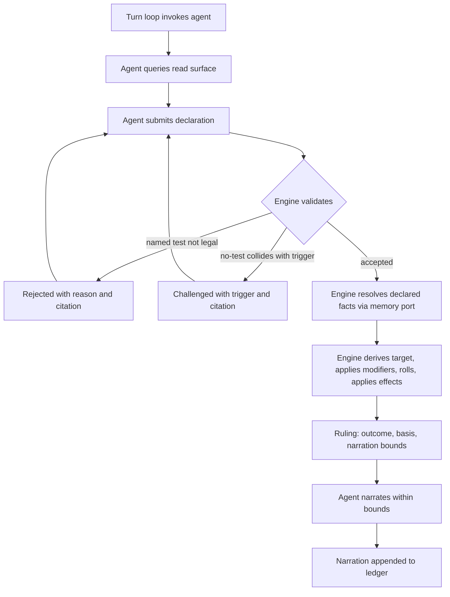
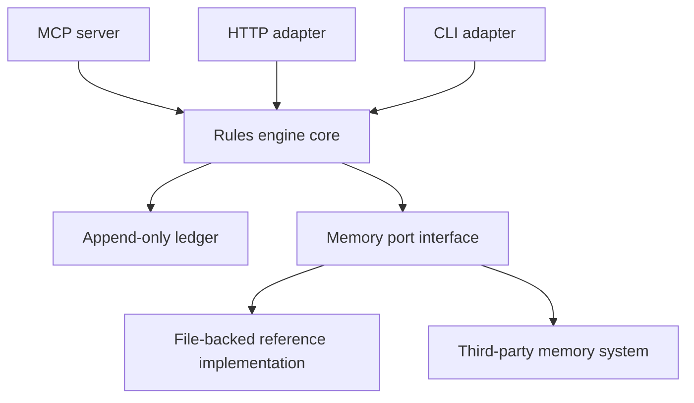
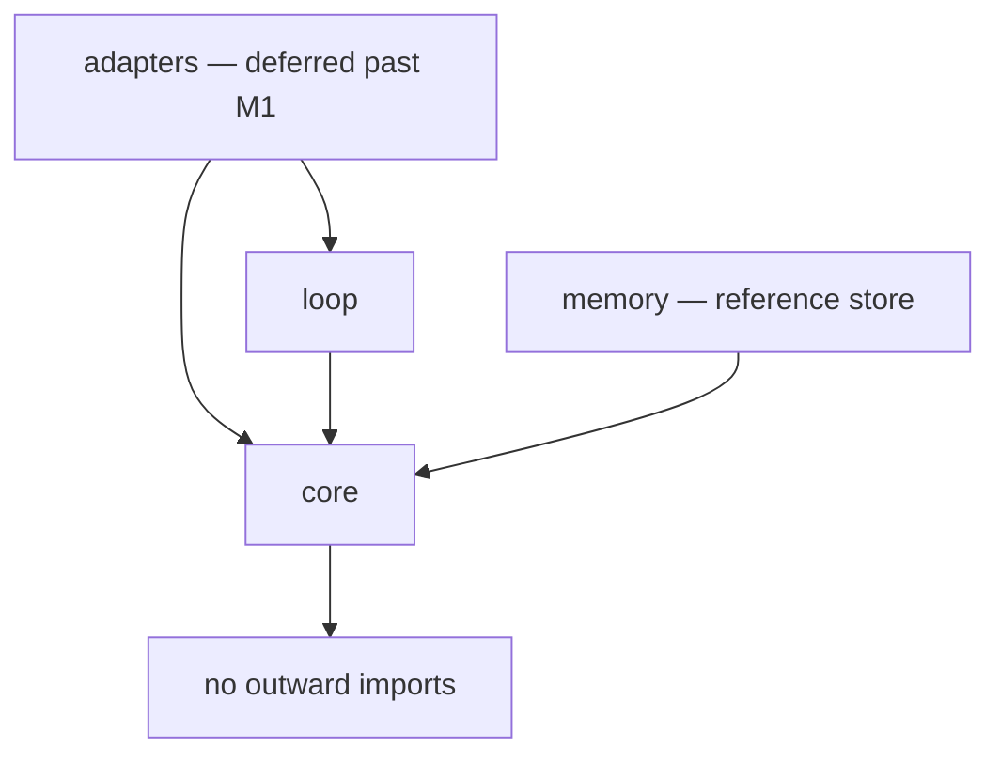
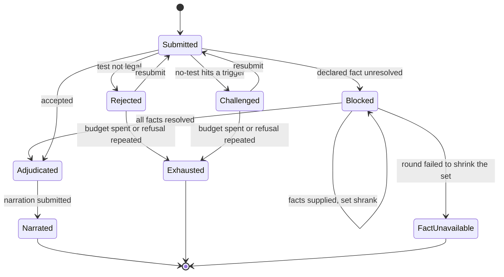
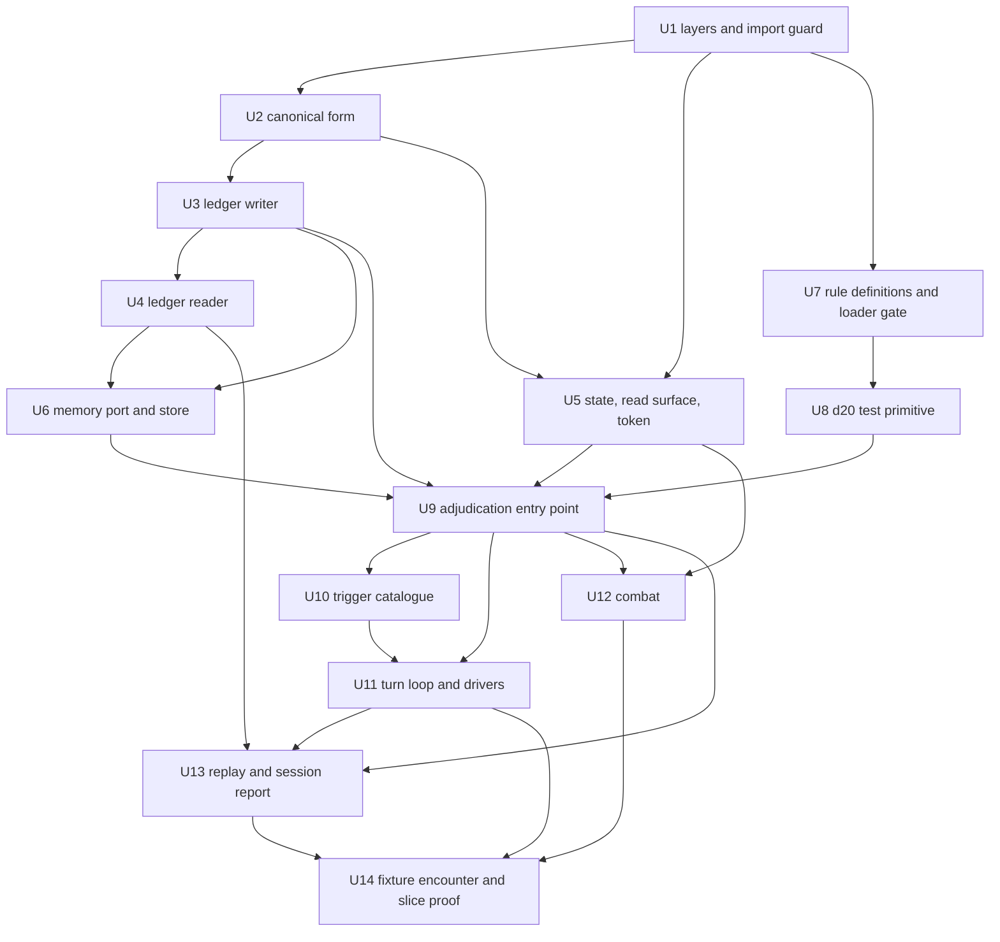

# SRD 5.2 Rules Engine - Plan

## Goal Capsule

- **Objective:** An open-source Python library that implements the SRD 5.2 mechanics in full and holds outcome authority, so that any LLM agent acting as a dungeon master can interpret fiction but cannot invent results.
- **This milestone (M1):** A playable vertical slice — one character, one encounter, end to end — running on invented fixture rules rather than SRD content. It exists to prove the architecture, not to ship coverage.
- **Product authority:** This Product Contract, then the eleven records in `docs/decisions/`. Where they disagree with a unit below, they win and the unit is wrong. The official SRD v5.2.1 is the authority on every mechanic, and no mechanic may be inferred from memory.
- **Execution profile:** Small stacked pull requests, roughly one per implementation unit, each green on the full four-command gate before the next begins. `main` stays green throughout.
- **Stop conditions:** Stop and ask when a unit cannot be built without contradicting a decision record; when a fixture rule would need to state a real SRD value to work; or when a guard test cannot be made to fail against the input it exists to reject.
- **Tail ownership:** Each unit lands as its own PR with a closing keyword for any issue it resolves. Deferrals discovered mid-unit are filed as issues before that unit's PR merges.
- **Open blockers:** None. The attribution errand (#3) gates SRD-derived data, and this milestone carries none — the fixture ruleset is invented and labelled as such.

---

## Product Contract

### Summary

A Python library implementing the SRD 5.2 mechanics in full, where the agent holds interpretation and the code holds outcome authority. An agent queries a read surface to learn what is legal, submits a declaration of which test applies or that none does, and receives a Ruling carrying the roll, the arithmetic, the SRD citations, and the bounds on what it may claim happened. Narrative facts that change rulings arrive through a typed port the engine owns but does not implement, and a turn-driving loop ships alongside the core, invoking the agent at defined points and forming what the adapters expose.

### Problem Frame

Running solo sessions with an LLM as dungeon master fails in a specific way: the model recognises a situation, skips straight to a narrated outcome, and the dice never enter the conversation. It did not compute a DC incorrectly. It never invoked the mechanic at all.

That defect is not fixed by moving arithmetic somewhere trustworthy. A correct dice function exposed as a tool is a tool the model may call, and a model that does not realise a check is warranted will not call it. The bug lives one step earlier, between "player describes an action" and "outcome exists."

The failure has a second face. Once an outcome is narrated freely, consequences accumulate that were never resolved by any rule — a successful lockpick becomes a guard who heard nothing, an NPC who now trusts you, a door that was unlocked all along. Each is an unrolled ruling presented as established fact, and by the next session they are indistinguishable from things the dice actually decided.

The cost is that no state in the campaign can be trusted, which makes continuity worthless even when it is technically persisted. There is no way to ask why a result happened, because no record exists of a decision having been made.

### Key Decisions

- **Engine-driven loop over agent-driven tool calls.** A Python loop owns the turn; the agent is invoked narrowly and never holds outcome authority. This is the only shape that makes inventing an outcome impossible rather than discouraged. The skip guarantee holds for callers the loop drives; a consumer that calls adjudication directly gets outcome authority without skip prevention. (session-settled: user-directed — chosen over tool-gated narration and a whole-turn referee pass: both leave the model deciding whether a rule was invoked.)

- **The agent seam is a generator of typed requests, not a callback.** The turn loop yields an `AgentRequest` and the driver sends back an `AgentResponse`; an object-shaped `Agent` adapter ships on top for the common case. Control inversion means one rules implementation serves synchronous, asynchronous, scripted, and human drivers — a callback shape would need a second async loop whose rules logic measured 100% duplicated (25 of 25 statements identical after stripping `await`), and a divergence between the two would be a rules bug visible only to async consumers. The seam is also the session transcript, so replay (R28) and the session-review report (R30) derive from it without the agent's cooperation. Reference bindings ship, and neither is an LLM: a scripted agent for tests and a CLI where the human answers, so v1 is playable with no model and no network. (session-settled: user-approved — chosen over a callback Protocol, a caller-pumped queue, and a subclass hook; see `docs/decisions/0001-agent-seam.md`.)

- **The engine can challenge a no-test declaration.** Triggers let the engine reject a claim that no check is needed and force re-adjudication. The silent skip is the observed defect, so it gets a deterministic guard rather than passive logging. Beyond the SRD's explicitly mechanical triggers — forced saves, attacks, stated hazards — the catalogue is project-authored, because the SRD leaves most of "does this need a check" to judgment. The catalogue is therefore known-incomplete, and its scope ships disclosed in the same way excluded mechanics are. (session-settled: user-directed — chosen over logging skips passively or having a second model review them: a model reviewing a model reintroduces the judgment being removed.)

- **The catalogue is data, and over-firing is a fidelity defect.** A trigger is a declarative row over a closed operator set, not a predicate, and the matcher never receives the declaration's free-text label — so R6 holds by construction rather than by review. Grounding is two-valued, `cited` or `authored`, because a tier assigned by judgment at intake stops carrying information. A report becomes an entry only after it is proven red, in both directions: a miss must first be shown not to challenge, and a false positive is narrowed by adding a condition rather than deleted. A wrongly-fired trigger makes the engine roll for something the SRD never called for, which is the project's defining defect with the sign flipped, so false positives carry `srd-fidelity`. Catalogue growth doubles as the recall instrument no other mechanism supplies: re-running closed ledgers against the current catalogue names every past session where a skip went through. (session-settled: user-approved — chosen over registered predicates, a predicate escape hatch, three grounding tiers, review-based admission, and two schemes for closing the improvised-intent gap; see `docs/decisions/0004-trigger-catalogue.md`.)

- **Retry bounds belong to the turn loop, and the engine never breaks a loop by choosing a test.** One budget per declaration slot covers challenges and rejections together, because the two interleave and any rule splitting them is arbitrary; two structurally identical refusals terminate at once, because a repeat proves the feedback is not being used — and under the trigger catalogue that usually means an over-broad row rather than a confused agent. Exhaustion is a terminal turn outcome, not a rules status: no rule says a badly-declared action has a result. Having the engine pick a legal default was rejected as a **bypass** — it would let an agent reach an adjudicated outcome by failing, putting a second path beside the declaration the agent is accountable for, and leaving R10 nothing to review. (session-settled: user-approved — chosen over separate budgets per status, an engine-selected default, unconditionally ending the turn, and bounds of 2 and 5; see `docs/decisions/0005-retry-bounds.md`.)

- **The ledger is JSONL behind a reader API, and its on-disk format is not public API.** R35 already commits the entry schemas, so the open question was only whether the envelope was public — and publishing later is cheap where unpublishing is not. A shipped reader gives consumers something stable to depend on, which is the only form of that promise that survives contact with users; export becomes a function of the reader rather than a second format to keep in step. The envelope is fixed for good and the payload alone is versioned, so integrity checking and the retrospective audit work across every version ever written. Digests are taken over canonical JSON with **floats excluded entirely** — the domain turns out to need none, which makes canonicalization implementable without a dependency and keeps approximate values out of a record meant to be authoritative. (session-settled: user-approved — chosen over a public file format, a separate export format, SQLite, a binary log, best-effort cross-version replay, and refusing files of unknown version; see `docs/decisions/0006-ledger-format.md`.)

- **The alternatives claim is made checkable by a read token, without relaxing R19.** The read surface returns the legal set with an opaque token naming the state generation it was derived from and a digest of the set; the declaration echoes it, and the engine reports `verified-fresh`, `verified-stale`, `unverified`, or `unread`. Recording the generation dissolves the ambiguity that had made re-derivation look unusable — a mismatch at the same generation is a false claim, and an older generation is an agent deciding from stale information, which in a single-actor sequential loop should never happen and is therefore a high-value signal of a cached read. A digest suffices because the agent is an LLM rather than an adversary: forging one is the only uncovered case. Legality has **one derivation** shared by the read surface and the adjudicator, so what is offered and what is accepted cannot drift. A failed verification is recorded and flagged, never a rejection — the alternatives are metadata about a decision, not the decision, and refusing would burn a retry slot over something no resubmission fixes. (session-settled: user-approved — chosen over trusting the claim, re-deriving without a token, relaxing R19, a MAC, independent derivations with a cross-check, and rejecting on failure; see `docs/decisions/0007-alternatives-verification.md`.)

- **The agent decides *that* a rule applies and *which*; it can never decide *how it turns out*.** Nothing deterministic can read freeform prose and know a check is warranted, so classification stays with the agent. Only outcome authority is structurally closable, and closing it is the whole design.

- **Full SRD 5.2 mechanical coverage in v1, including combat and spellcasting.** The ability check, the saving throw, and the attack roll are one primitive with shared advantage, proficiency, and modifier machinery. Scoping to checks alone would build a third of that primitive and retrofit the rest. (session-settled: user-directed — chosen over a checks-first slice with combat deferred: slicing the d20 test means retrofitting two thirds of it.)

- **SRD 5.2 (2024 rules) as the modelled edition.** (session-settled: user-directed — chosen over SRD 5.1 and over a 5.2-rules/5.1-data hybrid: 5.1 has a decade of machine-readable community data, but it is not the edition being played.)

- **Thick read surface.** The engine answers what a character can legally do right now rather than only judging declarations after the fact. An agent choosing from engine-supplied options misclassifies less than one recalling from training, and orientation is what makes the engine useful to somebody else's agent. (session-settled: user-directed — chosen over a judgment-only surface and over deferring orientation to v2: the latter changes the public contract after release.)

- **Narrative memory lives outside the engine behind a typed port.** If the engine consumed prose it would be interpreting narrative again, which is the capability being removed. The port returns typed mechanical values only, and v1 ships a file-backed reference implementation so a real campaign runs without a second system existing first. (session-settled: user-directed — chosen over building memory inside the engine and over shipping a port with no implementation: the first pulls a large second system into v1, the second leaves v1 unplayable.)

- **MCP is a delivery surface, not the foundation.** MCP exists to expose tools to an agent that decides when to call them, which is the seam being closed. The core is a plain typed library with no LLM dependency; MCP, HTTP, and CLI are adapters over the same contract. Open-sourcing makes this load-bearing rather than merely tidy, since consumers will want different transports. (session-settled: user-approved — chosen over building on MCP from the start: an adapter over a clean library is cheap to add, while a protocol-first core bakes in the model's discretion.)

- **Nothing escapes the engine before its record is durable.** A Ruling, challenge, or rejection is not returned until its ledger entry is committed — one synchronising write per adjudication, at the escape boundary rather than at the roll. An outcome that never left the engine is not lost; the only bad state is one that reached the caller with no durable trace, which is the original defect arriving through the back door. This costs nothing over the unsafe option: R5 already requires the Ruling to carry seed, resolved facts and target derivation, which is exactly R28's replay input set, so one record buys both the outcome and its verifiability. Entries are hash-chained — not to defend a solo campaign against its own owner, but because a torn tail record is genuinely reachable and because #10 may make this the session interchange format, where retrofitting a chain is expensive. (session-settled: user-approved — chosen over append-after and over writing determinants separately before the roll; see `docs/decisions/0002-ledger-durability.md`.)

- **Rulings bound what the narrator may claim.** A Ruling states not only what happened but what the caller may and may not assert happened, so unresolved consequences must be declared separately rather than appended to a successful roll. (session-settled: user-approved — chosen over returning outcome data alone: without bounds, free-associated consequences reproduce the original defect downstream of a correct roll.)

- **Mechanics are modelled by hand from the official SRD 5.2.1, with no community dataset as a seed.** Verification state — `unverified` / `verified` / `excluded`, with the reference section, the date, and a reason on an exclusion — lives alongside each entry, and only `verified` entries reach the engine. This costs a human read of the document per mechanic, and buys a provenance chain with no unnameable link in it. (session-settled: user-approved — reverses an earlier decision to seed from a community dataset, whose premise failed on inspection: no candidate carries effect shapes, the only structured candidate mixes two document revisions under one version label and omits the Rules Glossary entirely, and the best-covered candidate labels its SRD 5.2 material as OGL. See `docs/decisions/0003-seed-and-verification.md`.)

- **The memory port's fact set is derived from the SRD, with a namespaced extension channel.** Every rule that consumes a judgment or narrative input contributes a fact type; consumers add their own through the extension channel without a schema break. Committing only to what the SRD demands keeps the stable part stable, and growth stays additive. (session-settled: user-directed — chosen over a closed SRD-derived set, a minimal core set, and deferring to planning: a closed set forces forks, a minimal set is certain to need breaking additions, and deferring leaves the public schema unsettled while consumers could already be building.)

- **Extensions are namespaced storage, not extensible behaviour, and the reference store is a projection.** Namespaces are reverse-DNS and the core set is unnamespaced, so the distinction costs no lookup; a registry was disqualified by the constraint that named the problem, since a registry is coordination. **No engine rule may consume an extension fact** — which keeps R31 intact by construction and, as it turns out, dissolves two of this gate's four open questions and simplifies a third: R22's classification never fires for extensions, and the engine can be version-agnostic about namespaces because it interprets none. Widening this later is additive; narrowing it is not. Separately, because R25 already puts fact-write history in the ledger, the reference memory store holds current values only and rebuilds from the ledger — which removes both of SQLite's advantages at once and settles it as flat JSON, inspectable by the person whose campaign it is. (session-settled: user-approved — chosen over a registered prefix, URI namespaces, a reserved core namespace, permitting extensions in SRD-delegated slots or on the same footing as core facts, SQLite, and sharing the ledger's substrate; see `docs/decisions/0008-extension-channel.md` and `docs/decisions/0009-reference-memory-store.md`.)

- **The blocked loop bounds itself, so it gets no count bound.** A block is a *suspension* rather than a refusal — the declaration was accepted and stalled only at fact resolution — so it resumes the same declaration and is not charged to the agent's budget, whose terminal reasons all name agent behaviour. R21 makes fact dependencies static, so the unresolved set can only shrink and the loop terminates in at most as many rounds as the rule declares facts; only a round that fails to shrink it ends the turn. A count bound on top could do just one thing — cut off a sequence that was progressing, which in a human-driven session is a person supplying facts one at a time — and would be an untested safeguard for a case that cannot occur. Blocking is usually *correct*, the engine refusing to invent; what is defective is a fact type that blocks session after session, which means its `absent` classification is being tested and failing. (session-settled: user-approved — chosen over sharing the declaration budget, requiring re-declaration, naming one missing fact at a time, adding a count bound, and reporting repeated blocking without calling it a defect; see `docs/decisions/0010-blocked-loop.md`.)

- **Layer boundaries are a guard test, and schemas carry a min-reader floor.** The empty dependency list constrains what the package pulls in from outside, not how its own layers depend on each other — a core importing an adapter would break R33 while the list still read empty — so an import-graph test enforces two rules: the core imports nothing outward, and nothing outside the core imports a core submodule. The four engine-defined data schemas version independently as monotonic integers, and each payload carries a `compat` floor naming the lowest reader that can interpret it, because most schema changes are additive and a bare version number would make every one of them unreadable to the long-lived archives the retrospective audit exists to read. Three kinds of versioned thing are named rather than forced into one mechanism, since an opaque token and a consumer-declared namespace version each break a uniform compare-and-dispatch scheme. The build stamp makes no compatibility claim, and the public code API is unstable until v1.0 (#39). (session-settled: user-approved — chosen over documented convention, separate distributions, one version across all schemas, no compat signal, encoding the floor in the version field, semver alongside the stamp, and per-surface stability declarations; see `docs/decisions/0011-module-layout-and-versioning.md`.)

- **Completeness is the definition of done, so build order absorbs the risk.** Full coverage is fixed; sequencing is not. Work proceeds to a playable vertical slice first, then grinds toward full coverage, rather than building every subsystem partially.

### Actors

- A1. Player — one human running one player character, solo. The only human at the table.
- A2. DM agent — any LLM agent, not assumed to be a particular model. Interprets fiction, declares tests, narrates within returned bounds.
- A3. Rules engine — this library. Holds outcome authority and is the sole producer of results.
- A4. Memory system — an external component behind the typed port. Supplies narrative facts that carry mechanical weight; may be the shipped reference implementation or a third-party one.

### Requirements

**Adjudication core**

- R1. A single adjudication entry point is the only path by which an outcome comes into existence; no other API produces, modifies, or implies a result.
- R2. A declaration names the actor, the intent, and either the test the agent believes applies or an explicit no-test claim with a stated reason. The intent is either a structured value drawn from the read surface's enumerated legal actions or an intent marked improvised, carried alongside an optional free-text label. Improvised intents are validated, trigger-checked, and adjudicated like enumerated ones.
- R3. The engine validates every declaration against the SRD before resolving it, rejecting any test the character or situation cannot support.
- R4. The engine derives target numbers, applies modifiers and advantage state, and rolls the dice itself; no caller supplies a roll or a result.
- R5. Every adjudication returns a Ruling carrying status, the test performed, raw dice and seed, the target number and its derivation, the outcome, applied effects, the resolved value and provenance of every memory-port fact the ruling consumed, the alternatives the declaration recorded together with their verification verdict, SRD citations, and narration bounds.
- R6. When a no-test declaration collides with a trigger, the engine returns a challenged status naming every trigger that fired and its citation, in identifier order, and the declaration must be resubmitted. The catalogue is declarative data interpreted by a fixed matcher over a closed operator set; the matcher receives a projection of the declaration carrying its structured intent and engine-held situational state, and **excluding its free-text label**, so collision cannot be evaluated against prose. Rows are conjunctions — a disjunction is expressed as separate rows. The catalogue is versioned, the version in force is recorded on the declaration's ledger entry, and replay uses the recorded version. Specified in `docs/decisions/0004-trigger-catalogue.md` (#7).
- R7. Narration bounds state what the caller may and may not assert as having happened, so that consequences the ruling did not resolve must be declared separately. Bounds are advisory to the caller and are not enforced by the engine.
- R8. A turn-driving loop ships as a v1 deliverable outside the LLM-free core. It owns the turn, invokes the agent only at defined points, and is what the adapters expose. The invocation is expressed as a generator yielding typed requests — a declaration request, a narration request, or a blocked-fact request — to which the driver returns a typed response; the loop never calls the agent directly, and an object-shaped adapter and two non-LLM reference drivers (scripted, human CLI) ship alongside it. The loop also owns the retry bound: one budget per declaration slot covering challenges and rejections together, defaulting to 3 refusals, configurable, with `None` meaning unbounded; two structurally identical refusals terminate immediately. Exhaustion is a terminal turn outcome rather than a rules status, carrying a reason, the refusal history, and the alternatives the read surface offered — the engine never selects a test on the agent's behalf. Specified in `docs/decisions/0001-agent-seam.md` (#4) and `docs/decisions/0005-retry-bounds.md` (#11).
- R9. Mechanical character and encounter state — hit points, expended slots, active conditions, initiative order, remaining movement, and the positions and inter-combatant distances that range and area resolve against — has a named owner, a stated lifetime across calls, and a stated persistence path across sessions.
- R10. A declaration records the legal alternatives the read surface offered for its intent, and the Ruling and its ledger entry carry them, so a legal-but-wrong classification is reviewable after the fact. When no enumerated alternative covered the intent, the entry records that instead. The alternatives are **the agent's claim**, and they are carried with a verdict stating whether that claim was verified against what the read surface issued and whether it was still current: `verified-fresh`, `verified-stale`, `unverified`, or `unread`. The declaration echoes an opaque read token encoding the state generation the set was derived from and a digest of the set; a failed verification is recorded and reported, never a refusal to adjudicate. Specified in `docs/decisions/0007-alternatives-verification.md` (#8).

**Rules coverage**

- R11. The engine implements the SRD 5.2 d20 test as one primitive spanning ability checks, saving throws, and attack rolls.
- R12. The engine implements combat: initiative, round and turn order, the action economy including reactions and opportunity attacks, attack resolution against AC, damage, and criticals.
- R13. The engine implements movement in feet, including speed and difficult terrain.
- R14. The engine implements the SRD condition set, including how each condition modifies d20 tests.
- R15. The engine implements spellcasting: slots, prepared and known spells, concentration, components, spell save DCs, and spell attacks.
- R16. The engine resolves weapon range and reach and spell range and area of effect when validating and resolving attacks and spells, including disadvantage beyond a ranged weapon's normal range, against the positional state of R9 expressed in feet. R11 through R16 enumerate coverage rather than bound it; the SRD is the authority on what completeness requires.
- R17. An effect-shape inventory derived from SRD v5.2.1 is published with the repository. Coverage is checked against that inventory, and entries not yet implemented are disclosed rather than omitted silently.

**Read surface**

- R18. A read surface answers what is legal for a given character at the current moment: available actions, remaining movement, castable spells given slots, and active conditions with their mechanical effects. Each result carries an opaque read token, and legality has a single derivation shared with the adjudicator, so what is offered and what is accepted cannot drift.
- R19. Read-surface calls are idempotent, never mutate state, and never append to the ledger. The read token of R18 preserves this: it is derived and returned, never stored, and the state generation it names is incremented only by the operations that mutate state.

**Memory port**

- R20. The engine defines a typed port for narrative facts that affect rulings, returning typed values only and never prose.
- R21. Rule definitions declare which facts they consume, and the engine resolves them at adjudication time rather than accepting them from the caller. A rule may declare **core fact types only**; declaring a namespaced extension type is a load-time error. Specified in `docs/decisions/0008-extension-channel.md` (#9).
- R22. Each declared **core** fact type records whether its absent-value default is SRD-prescribed, engine-chosen, or absent entirely; the classification does not apply to extension types, since no rule consumes one. When the port holds no value, the engine applies the default and the Ruling names both that it defaulted and which kind it applied; when no default of any kind exists, the engine returns a blocked status naming **every** unresolved fact with its classification, rather than adjudicating. A block is a suspension, not a refusal: the declaration was accepted, so supplying the facts resumes the same declaration and the agent does not re-declare, and 0005's declaration budget is not charged. Because R21 makes fact dependencies static, the unresolved set can only shrink and the loop is self-terminating; a round that fails to shrink it ends the turn with a terminal `fact-unavailable` outcome. The engine never invents a default at that terminal — blocking means no default is honest. Specified in `docs/decisions/0010-blocked-loop.md` (#33).
- R23. The library ships a file-backed reference implementation of the port sufficient to run a solo campaign with continuity across sessions: flat JSON, one file per campaign, on a substrate separate from the ledger so the port stays swappable. The store holds current values only and is a **projection** — the ledger is the system of record for fact history, and the store rebuilds from it. "Sufficient" means five testable properties: every core fact type round-trips with its declared type; values survive a process restart; the store rebuilds from the ledger to an identical state; extension facts round-trip opaquely including unknown namespaces; and a read returns provenance sufficient for R27. Specified in `docs/decisions/0009-reference-memory-store.md` (#12).
- R24. The port supports namespaced extension fact types that consumers add without a schema break, distinct from the SRD-derived core set. Namespaces are **reverse-DNS** (`com.example.tool.mood`), so collision without coordination is impossible; the core set is **unnamespaced**, so carrying a namespace is what makes a type an extension. **No engine rule may consume an extension fact** — extensions get the port's typing, provenance, and ledger integration, but no resolver, so they cannot move an outcome and R31 stays intact. Each namespace versions independently and the engine never interprets one. Specified in `docs/decisions/0008-extension-channel.md` (#9).
- R25. The port names who may write each fact type. Every write appends to the ledger with provenance, and a fact consumed by a rule is traceable either to the ruling that produced it or to an explicit out-of-band entry the Ruling can cite. This is what makes the ledger authoritative over fact history and the memory store a rebuildable projection of it (R23). Fact values must therefore be ledger-representable, which excludes binary floating-point values.

**Ledger and auditability**

- R26. Every declaration, challenge, rejection, ruling, and fact write appends to an append-only ledger. A Ruling, challenge, or rejection is not returned until its ledger entry is durable — one synchronising write per adjudication, at the boundary where the outcome escapes the engine. Entries carry a monotonic sequence number, a checksum, and the previous entry's digest. A failed append raises rather than returning a status, because infrastructure failure is not a rules outcome. The ledger is JSONL, one entry per line. Every entry carries a fixed envelope — `seq`, `type`, `v`, `prev`, `sum`, `payload` — that is committed for the life of the project, so integrity checking and listing work across every payload version ever written; `v` versions the payload alone. Digests are taken over RFC 8785 canonical JSON restricted to exclude floating-point numbers, and **no binary float may appear in an entry**: the SRD's few fractional quantities are carried as exact strings or integer subunits. Entry `seq` 0 of a file is a `session` entry carrying the format, engine, and trigger-catalogue versions, and a session may not span engine versions. Specified in `docs/decisions/0002-ledger-durability.md` (#5) and `docs/decisions/0006-ledger-format.md` (#10).
- R27. A ruling influenced by a memory-supplied fact cites both the governing SRD rule and the fact with its provenance.
- R28. Any ruling entry replays to an identical outcome from its recorded seed, inputs, and resolved fact values, without re-querying the memory port. The guarantee holds **within an engine version**, which is recorded on the governing `session` entry. Replaying under a different engine version yields a reconciliation result naming both versions and both outcomes — never an integrity verdict, since a rules fix is not corruption. Specified in `docs/decisions/0006-ledger-format.md` (#10).
- R29. The narration produced under a Ruling is submitted back to the engine and appended to the ledger against that Ruling and the bounds it was issued under. The turn loop refuses the next declaration for an actor until that narration is submitted, and a turn that advances without one carries an explicit missing-narration marker.
- R30. A session-review report is generated from the ledger listing, per turn, the declaration, the alternatives offered, the Ruling, and the submitted narration, and flagging turns carrying a narration with no Ruling, a Ruling with no narration, or a challenge never re-adjudicated. Declaration slots that ended in retry exhaustion are flagged with their terminal reason and are excluded from the Ruling-with-no-narration check, since they produced no Ruling to narrate. The report flags any declaration whose alternatives verdict is other than `verified-fresh`, and any turn that ended in retry exhaustion or `fact-unavailable`. A fact type that blocks across sessions is a data-model defect — its R22 classification is being tested and failing — and is surfaced by the ledger reader's cross-session audit rather than by a single session's report. It names the engine version and the trigger catalogue version the session ran under. Report generation first verifies ledger sequence and chain integrity, so a corrupted ledger is reported as corrupted rather than silently summarised.

**Data provenance**

- R31. Every **SRD-derived** mechanic is verified against the official SRD 5.2.1 before it is trusted, and records the section it was verified against, the verification date, and its state. Fixture definitions are not SRD-derived and have nothing to verify against; they are admitted only by a separate entry point that refuses SRD-provenance entries outright, never ship, and are guarded against appearing under `src/`. Specified in `docs/decisions/0012-fixture-provenance.md` (#41).
- R32. Entries that fail verification are excluded from the engine, and the exclusion is disclosed rather than silently dropped.

**Packaging and open source**

- R33. The core takes no LLM dependency and no network dependency. The constraint binds the core; the turn-driving loop of R8 is outside it. **No module in the core may import from an outer layer** — an empty dependency list constrains what the package pulls in from outside, not how its own layers depend on each other, and a core that imports an adapter would break the promise while the list still read empty. Guarded by an import-graph test. Specified in `docs/decisions/0011-module-layout-and-versioning.md` (#13).
- R34. MCP, HTTP, and CLI access are adapter layers outside the core, built over the same contract, and expose the turn-driving loop as the only outcome-producing path. The layers are packages — `core`, `loop`, `memory`, `adapters` — and **nothing outside the core may import a core submodule**: outer layers use the core's re-exported surface only, so "the same contract" is a fact about the import graph rather than a description of intent. Guarded by the same test as R33.
- R35. The Declaration, Ruling, memory-port, and ledger-payload schemas are versioned and documented as public API, as is the ledger reader API. The ledger's on-disk format is **not** public API: the reader is the supported way to consume a ledger, and session export is a function of it rather than a second format. The four data schemas version **independently, as monotonic integers**, and every payload carries a reserved `compat` key at a fixed top-level position naming the lowest reader version that can correctly interpret it — so an additive change stays readable by older readers and only a genuine break raises the floor. Three kinds of versioned thing exist and are not forced into one mechanism: engine-defined data schemas as above; opaque engine-internal values such as the read token, which carry no external version and yield `unread` when unrecognised; and consumer-declared extension namespace versions, which are stored and never interpreted, where absent or malformed is not an error. The `mmddyyyy.x` build stamp identifies a build and makes **no compatibility claim**; the public code API is explicitly unstable until v1.0, for which a stability policy is a release requirement (#39). Specified in `docs/decisions/0011-module-layout-and-versioning.md` (#13).
- R36. The repository carries the attribution CC BY 4.0 requires for SRD 5.2.

### Key Flows

- F1. Adjudicated action
  - **Trigger:** The turn loop invokes A2 with the current state and A1's stated intent.
  - **Actors:** A2, A3, A4
  - **Steps:** A2 queries the read surface, then submits a declaration naming a test and carrying the legal alternatives it was offered. A3 validates it against the SRD, resolves any facts the rule declares through the port, derives the target number, rolls, and applies effects. A3 returns a Ruling and appends to the ledger.
  - **Outcome:** A2 narrates within the returned bounds, and the narration is appended to the ledger against that Ruling.
  - **Covered by:** R1, R2, R3, R4, R5, R7, R8, R10, R21, R26, R29

- F2. Challenged skip
  - **Trigger:** A2 declares that no test is needed for an intent that collides with an SRD-derived trigger.
  - **Actors:** A2, A3
  - **Steps:** A3 returns challenged status with the trigger and its citation. A2 resubmits a declaration naming a test. A3 adjudicates normally. Both the challenge and the resubmission append to the ledger.
  - **Outcome:** The skip becomes a recorded, reviewable exchange rather than an invisible omission.
  - **Covered by:** R6, R26

- F3. Rejected declaration
  - **Trigger:** A2 names a test the character or situation cannot support.
  - **Actors:** A2, A3
  - **Steps:** A3 returns rejected status with the reason and citation. A2 resubmits. The turn loop bounds the retries — 3 by default, shared with F2's challenges, and a structurally identical refusal twice terminates at once.
  - **Outcome:** No outcome is produced until a legal declaration is accepted. If the bound is reached the loop ends the slot with a terminal outcome naming the reason, the refusals, and the alternatives that were offered; the driver decides what follows. The engine never selects a test to break the loop.
  - **Covered by:** R3, R8, R26, R30

- F4. Memory-influenced ruling
  - **Trigger:** An accepted declaration names a rule that declares a narrative-fact dependency, such as social interaction depending on attitude.
  - **Actors:** A3, A4
  - **Steps:** A3 requests the typed fact from the port. A4 returns a typed value, or nothing. A3 derives the target number using the value or the SRD default, and cites both the rule and the fact with its provenance.
  - **Outcome:** The Ruling explains why the target number was what it was.
  - **Covered by:** R20, R21, R22, R27

### Acceptance Examples

- AE1. Silent skip is refused
  - **Covers R6, R26.**
  - **Given:** A1's character attempts to climb a rain-slick wall.
  - **When:** A2 declares that no test is needed because the character is athletic.
  - **Then:** The engine returns challenged status naming the trigger catalogue entry that fired and its SRD grounding, produces no outcome, and appends the challenge to the ledger.

- AE2. Unrolled consequence is not licensed
  - **Covers R7, R29.**
  - **Given:** A lockpicking check has succeeded.
  - **When:** A2 receives the Ruling.
  - **Then:** The bounds permit describing the lock opening and withhold any claim about whether the guard noticed, which requires its own declaration.

- AE3. Absent fact is disclosed, not assumed
  - **Covers R22, R27.**
  - **Given:** A persuasion attempt against an NPC the memory system holds no attitude for.
  - **When:** The engine resolves the DC.
  - **Then:** It applies the SRD default attitude, and the Ruling records that the value was defaulted rather than known.

- AE4. Attitude moves the target number visibly
  - **Covers R27.**
  - **Given:** The memory system reports a friendly attitude for the NPC.
  - **When:** The engine resolves the persuasion DC.
  - **Then:** The Ruling cites both the social interaction rule and the attitude fact with its provenance, so the DC is explainable after the fact.

- AE5. Rulings replay
  - **Covers R28.**
  - **Given:** Any ruling entry.
  - **When:** It is replayed from its recorded seed, inputs, and resolved fact values.
  - **Then:** The outcome is identical.

### Success Criteria

- Full SRD 5.2 mechanical coverage is the definition of done for v1: every entry in the published effect-shape inventory can be expressed and resolved by the engine. Partial coverage is an incomplete release, not a smaller one.
- A solo session run with a live DM agent produces **every narration behind a Ruling, and every Ruling narrated**, measured from the session-review report. This is the bar the playable vertical slice must clear.
  - **Amended by #197.** This read "no asserted outcome that did not originate in a Ruling" until a session was driven against the report and the two were found not to be the same claim. The report measures whether a narration **has** a Ruling; it never compares what the narration asserts against what the Ruling decided, and nothing else does either — R7 makes the narration bounds advisory by design, and enforcing them would need the engine to read prose. `tests/test_skip_guarantee.py` shows a missed attack narrated as a kill with the report coming back clean.
  - **What is therefore not measured**, and is stated here rather than left to be inferred from a green report: whether a narration stays inside the bounds the Ruling gave it. An agent that narrates beyond them is outside every instrument this project has, and R7 says that is by design.
- The rules test end to end with no model in the loop, and encounters replay deterministically from a seed.
- A reader can answer "why did this ruling come out this way" from the ledger alone, without reconstructing the session.
- A developer building an agent on this engine can implement the memory port and reach a working adjudication loop from the published schemas without reading engine internals.
- A playable vertical slice is reached as a development milestone well before v1 completes; it is not itself a release.

### Scope Boundaries

**Deferred for later**

- (#23) The narrative memory system itself — session history, relationships, NPC recall — beyond the reference implementation behind the port.
- (#22) A rules-text query endpoint serving SRD prose on demand. Citations travel in every Ruling; CC BY 4.0 would permit text, so this stays open rather than closed.
- (#21) Content population. The engine defines and consumes stat blocks and spell definitions; filling in the SRD bestiary and spell list is a parallel data track and not a blocker on the mechanics code. The line between them is the effect vocabulary: mechanical coverage is complete when every distinct SRD effect shape resolves, and content population is per-entry data written entirely in that vocabulary.
- (#24) Grid-based tactical movement. Movement resolves in feet, with the grid as the optional variant the SRD publishes it as.

**Outside this product's identity**

- Multiplayer, shared sessions, and any multi-user surface. The product is solo, one player character.
- Any user interface. The deliverable is a library plus adapters.
- Coupling to a specific LLM or agent framework. The engine serves any agent or none.
- Narrative or content generation. The engine adjudicates; it does not author.

### Dependencies / Assumptions

- (#3) SRD 5.2.1 (2024 rules) is published under CC BY 4.0, which permits redistribution with attribution. Confirm the exact licence and attribution wording against the published document before release.
- ~~A machine-readable community SRD 5.2 dataset is assumed to exist and is the intended seed.~~ **Settled by #6:** no usable dataset exists for the mechanics v1 needs, and mechanics are modelled by hand from the document. The data track grows accordingly. A structured seed remains plausible for content population (#21) and is evaluated there.
- (#3, #6) The official **SRD v5.2.1** document (1 May 2025) is the verification reference for every entry, and the only one. It gates the data track, not the mechanics code. v5.2.0 is a different document — it omits fifteen magic items and carries a duplicated Iron Golem stat block where the Knight belongs — so the revision must be named wherever the reference is cited.
- The SRD publishes movement and range in feet and treats the grid as an optional variant; the engine follows the published default.
- The player is solo with one character, so no concurrency, turn arbitration between humans, or shared-session state is assumed anywhere in the design.
- Conditions, attitudes, and similar states are mechanically typed in the SRD, which is what makes a typed memory port possible rather than a prose interface.
- Trigger firing is bounded by the situational state the agent chose to record: a hazard the agent never wrote to the port cannot collide with a trigger. The guard therefore narrows the agent's discretion rather than removing it.
- The SRD supplies explicit triggers only for forced saves, attacks, and stated hazards. Every other catalogue trigger is project-authored and grounded in, rather than cited from, the SRD. Catalogue recall is unmeasurable from play alone, since a missed skip leaves no trace — but it is measurable *retrospectively*, by re-running closed ledgers against a later catalogue (#7). Improvised intents carry no structured intent value, so they are matched on situational state alone; that reduced coverage is disclosed rather than closed.

### Outstanding Questions

> Every entry below is filed as a GitHub issue and carries its number. GitHub Issues is the
> single source of truth for open work — this list is a pointer, not a queue. Progress lives
> in the issues and in git, never in this document.

**Deferred to planning**

- ~~(#6) Which community SRD 5.2 dataset is used as the seed, and how its per-entry verification state is recorded.~~ **Settled** — see `docs/decisions/0003-seed-and-verification.md`.
- ~~(#9) How the namespaced extension channel on the memory port is expressed and versioned.~~ **Settled** — see `docs/decisions/0008-extension-channel.md`.
- ~~(#10) Ledger storage format and whether it doubles as the interchange format for sharing sessions.~~ **Settled** — see `docs/decisions/0006-ledger-format.md`. Schema-versioning mechanics remain #13's.
- ~~(#7) How SRD-derived triggers are catalogued and expressed, and how the catalogue grows from observed misses.~~ **Settled** — see `docs/decisions/0004-trigger-catalogue.md`.
- ~~(#11) Retry bounds for challenged and rejected declarations.~~ **Settled** — see `docs/decisions/0005-retry-bounds.md`. The `blocked` loop was deliberately excluded and is #33.
- ~~(#13) Python packaging, module layout, and schema versioning mechanics.~~ **Settled** — packaging in build `08212026.1`, layout and versioning in `docs/decisions/0011-module-layout-and-versioning.md`. The v1.0 API stability policy is #39.
- ~~(#12) Whether the reference memory implementation is flat-file or embedded database.~~ **Settled** — see `docs/decisions/0009-reference-memory-store.md`.
- ~~(#4) How the turn loop invokes an arbitrary agent without coupling to a specific LLM or framework, and whether v1 ships a reference binding for that seam the way it ships one for the memory port.~~ **SETTLED 2026-08-21** — generator of typed requests, with an object adapter and two non-LLM reference drivers. See `docs/decisions/0001-agent-seam.md`.
- ~~(#5) Whether a successful ledger append is a precondition of returning a Ruling, challenge, or rejection, and what durability and append-only integrity the ledger is assumed to provide.~~ **SETTLED 2026-08-21** — yes, at the escape boundary; one sync per adjudication; hash-chained entries; a failed append raises. See `docs/decisions/0002-ledger-durability.md`.
- ~~(#8) How the alternatives recorded on a declaration are verified, given that the read surface may not record what it offered.~~ **Settled** — see `docs/decisions/0007-alternatives-verification.md`.

### Sources / Research

- SRD v5.2.1 (2024 rules), Wizards of the Coast, CC BY 4.0 — the authoritative source for every mechanic in this contract.
- [`ddo-loadout-optimizer`](https://github.com/eddiefiggie/ddo-loadout-optimizer) is the closest prior art in method rather than domain: an authoritative external source turned into a rules-accurate engine, with exclude-until-verified data gating and per-result receipts. Its lesson — that rules fidelity lives or dies on data provenance rather than on the solver — is why R22 and R27 exist.
- No tabletop D&D or SRD prior art exists in my other projects; every other D&D-named one targets Dungeons & Dragons Online, a different ruleset.

---

## Planning Contract

**Product Contract preservation:** unchanged. Every requirement, actor, flow, acceptance example, and key decision above is carried verbatim from the requirements artifact and its eleven decision records. This section and everything below it add HOW; nothing above was rewritten.

### Scope of this milestone

M1 is the playable vertical slice. It builds the whole machinery — layers, ledger, read surface, memory port, adjudication, trigger catalogue, turn loop, report — and exactly enough rules coverage to run one fight: the unified d20 test, initiative, attacks against AC, damage, hit points, and dropping to 0. Conditions, movement in feet, spellcasting, range and area, and the effect-shape inventory are the milestones after it, not this one.

The slice runs on a fixture ruleset of invented mechanics. Nothing in M1 states an SRD value, so nothing in M1 is SRD-derived content and the attribution gate is untouched.

### Key Technical Decisions

- KTD1. M1 runs on invented fixture rules, never SRD content. The slice becomes provable today rather than waiting on an errand, and it proves something the real rules cannot — that the engine is not SRD-coupled, because it adjudicates a ruleset the SRD never described. (session-settled: user-approved — chosen over landing real SRD rules as `unverified` and over resolving the attribution errand first: the first makes the milestone's completion depend on work outside the plan, the second spends all momentum on an errand while ~90% of M1 is machinery the errand does not gate.)

- KTD2. A rule entry carries a provenance discriminator, and **provenance selects the entry point rather than a branch inside one**. `load_ruleset` admits `provenance: srd` entries that are `verified` and refuses any fixture outright; `load_fixture_ruleset` admits fixtures and refuses any SRD entry outright. They share parsing, shape validation, and R21's core-fact-type check, so the slice exercises the real machinery. There is no mode flag, so widening one cannot widen the other — which matters because a single loader with a strict arm and a lenient arm *reads* as an inconsistency, and the natural repair is to loosen it, admitting unverified SRD entries and reproducing the exact failure the seed decision exists to prevent. Specified in `docs/decisions/0012-fixture-provenance.md` (#41).

- KTD3. The fixture ruleset is test scaffolding and is not shipped in the installed package. Invented mechanics inside a distribution about SRD fidelity is a bad trade even when clearly labelled, and the guard in KTD2 is what makes the exclusion checkable rather than remembered. (session-settled: user-approved.)

- KTD4. The seed is drawn per adjudication, not per session, and recorded on the Ruling. Replay reproduces one entry from its own record without replaying the entries before it, which is what the replay requirement asks for; a session-level stream would make every replay depend on position in the sequence.

- KTD5. Every guard test lands with the unit whose invariant it protects, and is proven red before that unit's PR opens. The standing repository rule already requires this; naming it here matters because M1 introduces the layer-import guard, the float-rejection guard, the loader provenance gate, and the label-free matcher projection — four guards whose failure mode is silently inspecting nothing.

- KTD6. The session-review report is in the slice rather than deferred. The contract's primary success criterion — that every narration has a Ruling behind it (amended by #197; it read "no asserted outcome originated outside a Ruling" until that turned out to be a stronger claim than the report makes) — is measured from that report, so a slice without it cannot demonstrate the thing the slice exists to demonstrate. (session-settled: user-approved — chosen over deferring it to a later milestone.)

- KTD7. Slice depth stops at the d20 test plus initiative, attacks against AC, damage, and hit points. Conditions and movement would make a more convincing demo and both interact with the d20 test in ways better settled on a foundation that already works end to end. (session-settled: user-approved — chosen over adding conditions and movement, and over a check-only slice with no combat.)

- KTD8. Units land as small stacked pull requests, roughly one per unit. This is how every design gate landed in this repository: one PR, CI green, merge, next. A wrong turn costs one unit rather than the milestone. (session-settled: user-approved — chosen over grouped subsystem PRs and a single milestone PR.)

- KTD9. Adapters stay out of M1. The two reference drivers the agent-seam decision already commits to — scripted and human-CLI — are what make the slice playable without a model or a network; MCP and HTTP are delivery surfaces over a contract that must exist first.

### Open questions carried into implementation

- ~~OQ1. Does the fixture provenance path of KTD2 need its own decision record before U7 lands?~~ **Settled** — see `docs/decisions/0012-fixture-provenance.md` (#41). Provenance selects the entry point rather than a branch, so 0003 is scoped rather than relaxed and there is no gate to loosen.

### Risks & Dependencies

- Fixture rules may bake in shapes the real SRD breaks. The slice proves the machinery, not SRD fidelity, and an invented ruleset can be quietly convenient — a rule whose facts resolve cleanly because the fixture author chose them. Mitigation: the fixture ruleset deliberately includes a rule with an unresolvable fact and a trigger that fires on situational state alone, so the awkward paths are exercised rather than avoided.
- U9 is the largest unit and cannot be split without creating a half of the single adjudication entry point, which the first requirement forbids. Accepted rather than mitigated; it is the unit most likely to need a second pass in review.
- The layer-import guard sees static imports only. A deferred import or a string-driven loader evades it, so it is a floor rather than a proof, and the layer boundary still depends on review for anything dynamic.
- The attribution errand gates no unit here, and it does gate the milestone after this one. If it stays open, the next milestone cannot start on real rules even though this one completes.

### High-Level Technical Design

Four packages, with the import rules the layer decision makes a guard test rather than a convention. Arrows are the only permitted direction of dependency; the guard fails on any arrow drawn the other way, and on any import that reaches past a package's re-exported surface into its submodules.

A declaration slot is the unit the retry budget counts, and it has more terminal states than the happy path suggests. Three of the five ways a slot ends produce no Ruling at all, which is why the report has to distinguish them from a Ruling that was never narrated.

The build order is dependency-driven rather than subsystem-driven: the ledger exists before anything that must append to it, and the rule loader exists before anything that loads a rule.

### Assumptions

- The fixture ruleset can express a fight without borrowing an SRD number. Invented ability scores, an invented armour value, an invented damage die, and an invented creature are sufficient, because the machinery under test is indifferent to the values.
- Python's `secrets`-free, seed-reproducible `random.Random` is adequate for a solo campaign's dice. The requirement is reproducibility from a recorded seed, not unpredictability against an adversary.
- Canonical JSON can be implemented over the standard library alone once floats are excluded, which is what the ledger-format decision established. If an unforeseen payload needs a real number, that is a design change to escalate rather than a float to admit.
- No plan unit needs the official SRD document. If one turns out to, that unit is misscoped for M1.

### Sequencing

Units land in the dependency order above, one PR each. Three ordering constraints are not negotiable: the layer guard lands first so every later unit is born inside the boundary it will be held to; the ledger writer precedes anything that appends; and the rule loader precedes anything that loads a rule. Beyond those, adjacent units may be reordered where it helps.

---

## Implementation Units

### Unit index

| U-ID | Unit | Primary files | Depends on |
|---|---|---|---|
| U1 | Layer packages and the import guard | `src/srd_rules_engine/{core,loop,memory}/`, `tests/test_layer_boundaries.py` | — |
| U2 | Canonical form and the no-float guard | `src/srd_rules_engine/core/canonical.py`, `tests/test_canonical_form.py` | U1 |
| U3 | Ledger writer, envelope, chain, durability | `src/srd_rules_engine/core/ledger.py`, `tests/test_ledger_writer.py` | U1, U2 |
| U4 | Ledger reader, verification, torn tail | `src/srd_rules_engine/core/ledger_reader.py`, `tests/test_ledger_reader.py` | U3 |
| U5 | Mechanical state, read surface, read token | `src/srd_rules_engine/core/{state,read_surface}.py`, `tests/test_read_surface.py` | U1, U2 |
| U6 | Memory port and the reference store | `src/srd_rules_engine/core/memory_port.py`, `src/srd_rules_engine/memory/store.py` | U1, U3, U4 |
| U7 | Rule definitions, verification state, loader gate | `src/srd_rules_engine/core/rules.py`, `tests/test_rule_loader.py` | U1 |
| U8 | The unified d20 test primitive | `src/srd_rules_engine/core/d20.py`, `tests/test_d20_test.py` | U1, U7 |
| U9 | The adjudication entry point and the Ruling | `src/srd_rules_engine/core/adjudicate.py`, `tests/test_adjudication.py` | U3, U5, U6, U7, U8 |
| U10 | Trigger catalogue, matcher, projection | `src/srd_rules_engine/core/triggers.py`, `tests/test_trigger_matcher.py` | U7, U9 |
| U11 | Turn loop, retry bounds, blocked loop, drivers | `src/srd_rules_engine/loop/`, `tests/test_turn_loop.py` | U9, U10 |
| U12 | Combat: initiative, attack, damage, hit points | `src/srd_rules_engine/core/combat.py`, `tests/test_combat.py` | U5, U9 |
| U13 | Replay and the session-review report | `src/srd_rules_engine/core/report.py`, `tests/test_replay_and_report.py` | U4, U9, U11 |
| U14 | The fixture encounter and the slice proof | `tests/fixtures/`, `tests/test_vertical_slice.py` | U11, U12, U13 |

### U1. Layer packages and the import guard

- **Goal:** Establish `core`, `loop`, and `memory` as packages, and make the two import rules a test rather than a convention before any code exists to violate them.
- **Requirements:** R33, R34
- **Dependencies:** none
- **Files:** `src/srd_rules_engine/core/__init__.py`, `src/srd_rules_engine/loop/__init__.py`, `src/srd_rules_engine/memory/__init__.py`, `tests/test_layer_boundaries.py`
- **Approach:** Parse every module under `src/` with `ast`, collect `Import` and `ImportFrom` targets, map each module to its layer by path, and assert two rules: no module in `core` imports from `loop`, `memory`, or `adapters`; and no module outside `core` imports a `core` submodule rather than `core` itself. The `adapters` package is not created — M1 has no adapters, and the rule is written to cover it when it arrives.
- **Execution note:** Write the guard first and prove it red both ways before the packages have any content — a guard authored after the code it governs tends to be shaped around what the code already does.
- **Patterns to follow:** `tests/test_core_has_no_runtime_dependencies.py` for the shape of a machine-checked promise; `tests/test_no_local_leakage.py` for walking tracked files and reporting every finding rather than the first.
- **Test scenarios:**
  - A core module importing `srd_rules_engine.loop` fails the guard, naming the offending module and its target.
  - A loop module importing `srd_rules_engine.core.adjudicate` fails the guard; importing `srd_rules_engine.core` passes.
  - A memory module importing `srd_rules_engine.core` passes.
  - The guard reports every violation in one run, not just the first.
  - The guard fails when it finds zero modules to scan, so an empty traversal cannot pass vacuously.
- **Verification:** Both violations confirmed red, then restored; the four-command gate green.

### U2. Canonical form and the no-float guard

- **Goal:** One canonicalization function whose output is the only input to any digest, and a guard that rejects a float anywhere in a payload.
- **Requirements:** R26
- **Dependencies:** U1
- **Files:** `src/srd_rules_engine/core/canonical.py`, `tests/test_canonical_form.py`
- **Approach:** RFC 8785 restricted to exclude floating-point numbers — UTF-8, keys sorted, no insignificant whitespace, integers only. Rejecting floats removes the specification's hardest requirement, so this needs no dependency. A float found anywhere in a structure raises rather than being coerced, because a coerced value would be silently wrong in the one record meant to be authoritative.
- **Patterns to follow:** the existing guard tests' habit of assembling forbidden patterns so the test file does not trip its own scan.
- **Test scenarios:**
  - The same mapping with keys in different insertion orders canonicalizes to identical bytes.
  - Nested structures canonicalize deterministically at every depth.
  - A float at the top level raises; a float nested inside a list inside a mapping also raises.
  - A string that looks like a float (`"1.5"`) is preserved unchanged — the rule is about types, not appearances.
  - Non-ASCII text round-trips byte-identically under repeated canonicalization.
- **Verification:** Introduce a float into a payload the ledger would write and confirm the guard goes red; restore.

### U3. Ledger writer, envelope, chain, durability

- **Goal:** An append-only JSONL ledger whose entries carry the fixed envelope, chain to their predecessor, and reach durable storage before anything escapes the engine.
- **Requirements:** R26
- **Dependencies:** U1, U2
- **Files:** `src/srd_rules_engine/core/ledger.py`, `tests/test_ledger_writer.py`
- **Approach:** Each entry carries `seq`, `type`, `v`, `prev`, `sum`, `payload`, with `sum` taken over the canonical form of the entry minus `sum` itself, and `prev` equal to the previous entry's `sum`. Every payload carries its reserved `compat` key. Entry `seq` 0 of a file is a `session` entry naming the format, engine, and trigger-catalogue versions. Several entries may be buffered and covered by one synchronising write at the escape boundary. A failed append raises `LedgerUnavailable`; it never returns a rules status, because infrastructure failure is not a rules outcome.
- **Test scenarios:**
  - A session entry is written at `seq` 0 and its `prev` is absent.
  - Entry N+1's `prev` equals entry N's `sum`.
  - An entry whose `payload` is mutated after writing fails checksum verification.
  - Several entries written in one adjudication are all present after a single synchronising write.
  - A write to an unwritable destination raises `LedgerUnavailable` rather than returning a status object.
  - Every entry payload carries `compat`, and a payload missing it is refused at write time.
- **Verification:** Simulate the escape boundary as an early return and assert what reached durable storage in each case.

### U4. Ledger reader, verification, torn tail

- **Goal:** The supported way to consume a ledger — verify, iterate, and report a torn tail without silently repairing it.
- **Requirements:** R26, R30, R35
- **Dependencies:** U3
- **Files:** `src/srd_rules_engine/core/ledger_reader.py`, `tests/test_ledger_reader.py`
- **Approach:** Envelope reading works across every payload version ever written, so chain verification, sequence checking, and listing never require a known `v`. Payload interpretation compares the reader's version against the payload's `compat` floor: at or above it, interpret; below it, report the entry unauditable rather than skipping it. A trailing line that fails to parse, fails its checksum, breaks sequence, or breaks the chain is reported, with truncation to the last valid entry offered as an explicit operation. The reader never truncates on its own and never refuses to open a file — a crashed session must stay reopenable.
- **Test scenarios:**
  - A ledger with a deleted middle entry reports a sequence gap and a broken chain.
  - An entry edited with its checksum recomputed still breaks the chain.
  - A file truncated mid-final-line opens, reports a torn tail, and leaves the file unchanged until repair is requested.
  - A payload declaring a `compat` floor above the reader's version is reported unauditable, and its envelope is still listed.
  - A payload declaring a floor at or below the reader's version is interpreted even when its `v` is higher than any version the reader knows.
- **Verification:** Corrupt a ledger four ways — torn tail, deleted entry, edited-with-stale-checksum, edited-with-recomputed-checksum — and confirm each is caught and named distinctly.

### U5. Mechanical state, read surface, read token

- **Goal:** State with a named owner and a monotonic generation, a read surface that answers what is legal, and the opaque token that makes the agent's alternatives claim checkable.
- **Requirements:** R9, R18, R19, R10
- **Dependencies:** U1, U2
- **Files:** `src/srd_rules_engine/core/state.py`, `src/srd_rules_engine/core/read_surface.py`, `tests/test_read_surface.py`
- **Approach:** The generation increments on every mutation to the state the read surface reports over, and never on a read. Legality has one derivation, used here to enumerate and by adjudication to validate, so what is offered and what is accepted cannot drift. The token encodes the generation and a digest of the offered set over U2's canonical form; it is derived and returned, never stored.
- **Execution note:** Prove the non-mutation property directly — snapshot the state and the generation, run every read-surface call, and assert both are unchanged.
- **Test scenarios:**
  - A read-surface call leaves the state and the generation unchanged, and appends nothing.
  - Two identical read calls at the same generation return identical tokens.
  - A mutation increments the generation, and the next read returns a different token.
  - A token echoed back with the set it was issued for verifies; the same token echoed with one alternative removed does not.
  - A token from an earlier generation is recognised as genuine but stale, distinctly from a token whose digest does not match.
  - A declaration carrying no token yields the unread verdict rather than an error.

### U6. Memory port and the reference store

- **Goal:** The typed port and a flat-JSON reference implementation that holds current values and rebuilds from the ledger.
- **Requirements:** R20, R21, R22, R23, R24, R25
- **Dependencies:** U1, U3, U4
- **Files:** `src/srd_rules_engine/core/memory_port.py`, `src/srd_rules_engine/memory/store.py`, `tests/test_memory_port.py`, `tests/test_reference_store.py`
- **Approach:** The port returns typed values only. Core fact types are unnamespaced; a reverse-DNS namespace is what makes a type an extension, and extensions are stored and returned without interpretation. Every write appends to the ledger with provenance, which is what makes the store a projection rather than a system of record. The store is one JSON file per campaign on a substrate separate from the ledger.
- **Patterns to follow:** the ledger writer's provenance shape from U3, so a fact write and a ruling entry carry the same provenance vocabulary.
- **Test scenarios:**
  - Every core fact type round-trips with its declared type through a process restart.
  - The store rebuilt by replaying the ledger's fact writes is identical to the live store.
  - An extension fact in a namespace the store has never seen round-trips unchanged, including its declared version.
  - An extension fact whose version is absent or malformed round-trips without error.
  - A read returns provenance sufficient to cite the ruling or out-of-band entry that produced the value.
  - A float supplied as a fact value is refused, because the write must be ledger-representable.
- **Verification:** Delete the store file, rebuild from the ledger, and assert an identical state.

### U7. Rule definitions, verification state, loader gate

- **Goal:** The rule entity — what facts it declares, what section it cites, what verification state it carries — and a provenance-aware loader that refuses what must not load.
- **Requirements:** R21, R31, R32
- **Dependencies:** U1
- **Files:** `src/srd_rules_engine/core/rules.py`, `tests/test_rule_loader.py`
- **Approach:** A rule declares the fact types it consumes, and may declare core types only — a namespaced extension type is a load-time error, not a runtime failure. Each entry carries a verification block: state, reference section, date, and a reason required on an exclusion. The loader is provenance-aware per KTD2: an SRD-provenance entry loads only when verified; a fixture-provenance entry loads only into a ruleset the caller asked for by name; a shipped ruleset containing a fixture entry fails the build.
- **Execution note:** This unit's guard is the one most likely to be quietly wrong, because a loader that admits everything passes every test that only checks the happy path. Prove all three refusals red.
- **Test scenarios:**
  - An SRD-provenance rule marked unverified is refused, and the refusal names the rule and its state.
  - An SRD-provenance rule marked excluded is refused, and its recorded reason is surfaced rather than dropped.
  - A fixture-provenance rule loads into a named fixture ruleset and is refused from a shipped ruleset.
  - A rule declaring a namespaced extension fact type fails to load, naming the offending type.
  - A rule declaring only core fact types loads.
  - An entry missing its verification block is malformed, not merely untracked.
- **Verification:** Flip a verified entry to unverified and confirm the loader goes red; restore.

### U8. The unified d20 test primitive

- **Goal:** One primitive spanning ability checks, saving throws, and attack rolls, with shared advantage, proficiency, and modifier machinery.
- **Requirements:** R4, R11
- **Dependencies:** U1, U7
- **Files:** `src/srd_rules_engine/core/d20.py`, `tests/test_d20_test.py`
- **Approach:** One function derives a target number, assembles modifiers, resolves advantage state, rolls, and returns the raw dice alongside the result. The seed arrives per invocation from the adjudication boundary per KTD4, so the same seed and inputs always produce the same dice. The three test kinds differ in what supplies the target number, not in how the roll resolves.
- **Test scenarios:**
  - The same seed and inputs produce identical dice across repeated invocations and across processes.
  - Advantage rolls two dice and takes the higher; disadvantage takes the lower; both present cancel to a single roll.
  - The raw dice are returned alongside the total, so a Ruling can carry both.
  - A check, a save, and an attack against the same target number and modifiers resolve identically — the kind changes only where the target came from.
  - Modifiers from separate sources accumulate in a stated order, so the derivation is reconstructable from the record.
- **Verification:** Replay a recorded seed and inputs and assert identical dice.

### U9. The adjudication entry point and the Ruling

- **Goal:** The single path by which an outcome comes into existence, returning a Ruling that carries everything needed to explain and replay it.
- **Requirements:** R1, R2, R3, R5, R7, R10, R21, R22, R26, R27
- **Dependencies:** U3, U5, U6, U7, U8
- **Files:** `src/srd_rules_engine/core/adjudicate.py`, `tests/test_adjudication.py`
- **Approach:** One entry point validates the declaration against the same legality derivation the read surface uses, resolves every fact the rule declares through the port, derives the target number, rolls, applies effects, and returns a Ruling. The Ruling carries status, the test performed, the raw dice and seed, the target number and its derivation, applied effects, every resolved fact with its provenance, the recorded alternatives with their verification verdict, citations, and narration bounds. Nothing escapes before its ledger entry is durable. A declared fact with no value and no default of any kind returns blocked naming every unresolved fact, not the first.
- **Test scenarios:**
  - A legal declaration produces a Ruling whose recorded target derivation reconstructs the target number.
  - A declaration naming a test the situation cannot support is rejected with a reason and a citation, and no outcome is produced.
  - A rule consuming a fact the port does not hold applies the SRD-prescribed default and the Ruling records both that it defaulted and which kind of default applied. Covers AE3.
  - A rule consuming a fact the port does hold cites the governing rule and the fact with its provenance, and the resolved value moves the target number. Covers AE4 — through an invented fixture rule and fact type, since the SRD's social-interaction rule and attitude fact are not in this milestone.
  - Two unresolvable facts produce one blocked status naming both.
  - The Ruling's narration bounds withhold a claim the ruling did not resolve. Covers AE2.
  - A crash simulated after the roll but before the return leaves no unrecorded outcome, and a crash after the return leaves a durable record.
  - An alternatives claim that does not match the token's digest is recorded unverified and the adjudication still proceeds.

### U10. Trigger catalogue, matcher, projection

- **Goal:** The challenge mechanism — declarative rows, a fixed matcher, and a projection that structurally cannot see the declaration's free-text label.
- **Requirements:** R6
- **Dependencies:** U7, U9
- **Files:** `src/srd_rules_engine/core/triggers.py`, `tests/test_trigger_matcher.py`
- **Approach:** A trigger is a data row carrying an identifier, grounding, a reference or rationale, match conditions over a closed operator set, a challenge message, and the catalogue version it first appeared in. Rows are conjunctions; an alternative is a separate row. The matcher receives a projection carrying structured intent and situational state and nothing else — the label is not in scope, so the prohibition holds by construction. Every matching row is reported in identifier order, and the catalogue version in force is recorded on the declaration's ledger entry.
- **Execution note:** Assert the projection's shape directly rather than asserting that the matcher happens not to use the label — the guarantee is about what the matcher can see, not what it currently does.
- **Test scenarios:**
  - The projection handed to the matcher contains no free-text label field at all.
  - A no-test claim colliding with a fixture trigger returns challenged, naming the row and its grounding, and produces no outcome. Covers AE1.
  - Two rows matching the same declaration are both reported, in identifier order.
  - A row whose conditions are all satisfied fires; a row with one condition unsatisfied does not.
  - An improvised intent is matched on situational state alone and still fires a state-only row.
  - The catalogue version recorded on the declaration entry is the version in force at adjudication.
- **Verification:** Add a label field to the projection and confirm the shape assertion goes red; restore.

### U11. Turn loop, retry bounds, blocked loop, drivers

- **Goal:** The loop that owns the turn, yields typed requests, bounds retries, and ships two non-LLM drivers so the slice is playable with no model and no network.
- **Requirements:** R8, R29
- **Dependencies:** U9, U10
- **Files:** `src/srd_rules_engine/loop/turn.py`, `src/srd_rules_engine/loop/drivers.py`, `tests/test_turn_loop.py`, `tests/test_drivers.py`
- **Approach:** The loop is a generator yielding a declaration request, a narration request, or a blocked-fact request, to which the driver returns a typed response. One budget per declaration slot covers challenges and rejections together, defaulting to three refusals and configurable to unbounded. Two structurally identical refusals terminate immediately — identity is the trigger identifier set or the reason code and citation, never message text. Exhaustion ends the slot with a terminal outcome carrying the reason, the refusal history, and the offered alternatives. A block is a suspension: supplying the facts resumes the same declaration, the agent does not re-declare, and the budget is not charged. The loop refuses the next declaration for an actor until the previous Ruling's narration is submitted.
- **Test scenarios:**
  - A challenge answered with a legal test produces a Ruling and never touches the budget.
  - Three differing refusals exhaust the slot with the churn reason matching what actually differed.
  - Two structurally identical refusals terminate at once, before the budget is spent, with the no-progress reason.
  - Two refusals with different message text but the same trigger identifier set count as identical.
  - An unbounded configuration does not terminate on count, and still terminates on no progress.
  - A blocked round that shrinks the unresolved set continues; a round that does not ends the turn as fact-unavailable.
  - A resumed block re-adjudicates the original declaration rather than requesting a new one.
  - The loop refuses a second declaration for an actor whose previous Ruling has no narration, and a turn advanced without one carries the missing-narration marker.
  - The scripted driver runs a full turn with no model; the human-CLI driver does the same with scripted input.

### U12. Combat: initiative, attack, damage, hit points

- **Goal:** Enough of the combat requirement to run one fight — turn order, attacks against an armour value, damage, hit points, and dropping to 0.
- **Requirements:** R12, R9
- **Dependencies:** U5, U9
- **Files:** `src/srd_rules_engine/core/combat.py`, `tests/test_combat.py`
- **Approach:** Initiative orders combatants and the order is state the read surface reports over, so it participates in the generation counter. An attack is the d20 test primitive with the target's armour value as the target number. Damage reduces hit points; reaching 0 is a state transition the read surface reflects. Reactions, opportunity attacks, and the full action economy are named as the next milestone and are not built here.
- **Test scenarios:**
  - Initiative produces a deterministic order from a recorded seed.
  - An attack meeting the armour value hits; one below it misses; both produce a Ruling.
  - Damage reduces hit points, and the read surface reports the reduced value at the next generation.
  - A combatant reduced to 0 hit points is reported as such, and the read surface stops offering it actions.
  - Advancing the turn moves to the next combatant in initiative order and increments the generation.
  - Applying damage twice from the same Ruling is refused, so an effect cannot be applied more than once.

### U13. Replay and the session-review report

- **Goal:** Replay a ruling entry to an identical outcome, and generate the report the primary success criterion is measured from.
- **Requirements:** R28, R30
- **Dependencies:** U4, U9, U11
- **Files:** `src/srd_rules_engine/core/report.py`, `tests/test_replay_and_report.py`
- **Approach:** Replay reproduces an outcome from the entry's recorded seed, inputs, and resolved fact values, without re-querying the port, and within a matching engine version. A differing engine version yields a reconciliation result naming both versions and both outcomes, never an integrity verdict. The report verifies sequence and chain integrity first, then lists per turn the declaration, the alternatives offered, the Ruling, and the narration — flagging a narration with no Ruling, a Ruling with no narration, a challenge never re-adjudicated, any alternatives verdict other than verified-fresh, and any turn ending in exhaustion or fact-unavailable. Slots that ended without a Ruling are excluded from the Ruling-with-no-narration check.
- **Test scenarios:**
  - A ruling entry replays to an identical outcome. Covers AE5.
  - Replay does not query the memory port, proven with a port that raises on any call.
  - An entry whose governing engine version differs yields a reconciliation result, not a corruption verdict.
  - A ledger with a broken chain is reported as corrupted rather than silently summarised.
  - A turn with a narration and no Ruling is flagged; a turn that ended in exhaustion is flagged with its reason and is not also flagged as a missing narration.
  - The report names the engine version and the catalogue version the session ran under.

### U14. The fixture encounter and the slice proof

- **Goal:** One character, one encounter, end to end — the milestone's demonstration, and the acceptance examples the slice can reach.
- **Requirements:** R1, R6, R7, R8, R26, R28, R29, R30
- **Dependencies:** U11, U12, U13
- **Files:** `tests/fixtures/ruleset.py`, `tests/fixtures/encounter.py`, `tests/test_vertical_slice.py`
- **Approach:** An invented ruleset — invented ability values, an invented armour value, an invented damage die, an invented creature, and a small trigger catalogue — carrying fixture provenance so KTD2's loader gate admits it only here. A scripted driver runs a full encounter from initiative to a combatant reaching 0, and the session-review report over the resulting ledger is the assertion.
- **Execution note:** The end-to-end assertion is the report, not a sequence of intermediate states. A slice that passes because each step was checked in isolation has not demonstrated the property the milestone exists to demonstrate.
- **Patterns to follow:** the fixture ruleset never states an SRD value; where a real ruleset would cite a section, the fixture records that it is invented.
- **Test scenarios:**
  - A full encounter runs from initiative to a combatant at 0 hit points with no model and no network.
  - The report over the finished encounter shows every narration behind a Ruling and every Ruling narrated (#197).
  - A no-test claim mid-encounter is challenged and the resubmission is adjudicated, and both appear in the report. Covers AE1.
  - Every Ruling in the encounter replays to an identical outcome. Covers AE5.
  - The same seed reruns the entire encounter to an identical ledger, chain digests included.
  - The fixture ruleset is refused when loaded as a shipped ruleset.
  - An encounter run with a narration deliberately withheld is reported as a Ruling with no narration.
  - An encounter run with a challenge deliberately left un-resubmitted is reported as a challenge never re-adjudicated.
  - An encounter run with a stale read token is reported with an alternatives verdict other than verified-fresh.

---

## Verification Contract

Every unit is verified by the repository's full gate. Running a subset locally and discovering the skipped check in CI has already happened here, so all four commands run before every PR opens.

| Gate | Command | Applies to |
|---|---|---|
| Tests | `pytest` | Every unit |
| Lint | `ruff check .` | Every unit |
| Format | `ruff format --check .` | Every unit, including fenced Python in Markdown |
| Types | `mypy` | Every unit — strict, over `src` and `tests` |

CI runs exactly that gate on every pull request across Python 3.11, 3.12, and 3.13, and `main` is protected behind it.

Two proof obligations sit on top of the gate and are not satisfied by a green suite:

- **Every new guard is proven red.** Corrupt the input the guard exists to reject, confirm it fails, restore. The guards this milestone introduces are the layer-import guard (U1), the float rejection (U2), the loader's three refusals (U7), and the matcher projection's absent label (U10). A guard that has never been seen red may be inspecting nothing.
- **Every new test is proven to fail against the pre-change tree.** Export the base commit to a scratch directory, copy the new tests over it, and run them. Anything still passing covers nothing. Deliberate no-change guards are the exception.

The milestone's own proof is U14's session-review report over a completed fixture encounter, showing every narration behind a Ruling and every Ruling narrated (#197).

---

## Definition of Done

**Per unit**

- The unit's test scenarios are implemented and passing, and its guard tests have been proven red and restored.
- The four-command gate is green locally and in CI across all three Python versions.
- Code implementing a numbered requirement names it in the docstring or the PR body, so coverage stays countable.
- The PR closes any issue it resolves with a closing keyword, and any deferral discovered during the unit is filed as an issue before the PR merges.
- No abandoned experimental code remains in the diff.

**Milestone**

- A scripted driver runs one character through one encounter end to end, with no model and no network in the loop.
- The session-review report over that encounter accounts for every turn: each declaration with its Ruling or its terminal outcome, and each Ruling with its narration, leaving nothing unaccounted.
- The report **detects each defect condition when one is deliberately injected** — a narration with no Ruling, a Ruling with no narration, a challenge never re-adjudicated, an alternatives verdict other than verified-fresh, and a slot ending in exhaustion or fact-unavailable. Detection is what a scripted driver can prove; see the note below on what it cannot.
- The encounter replays from its seed to an identical ledger, chain digests included.
- The fixture ruleset is refused by a shipped ruleset load, and no SRD value appears anywhere in the milestone's code or fixtures.
- The layer-import guard, the float rejection, the loader's provenance gate, and the matcher's label-free projection are all present and have each been observed red.
- The build stamp and README's current-build line are bumped together and say what actually shipped. _(Amended 2026-08-24 by [0024](../decisions/0024-the-build-line-is-the-build-record.md): this criterion also required a `CHANGELOG.md` entry, and that file is retired — [#146](https://github.com/eddiefiggie/srd-rules-engine/issues/146).)_
- All five acceptance examples are covered by named tests: the silent-skip refusal, the unrolled-consequence bound, the absent-fact disclosure, the fact that moves a target number visibly, and deterministic replay. The last two are reached through invented fixture fact types rather than the SRD's attitude and social-interaction rules — the mechanism under test is that a resolved fact moves the target number and is cited with its provenance, which is indifferent to which rule consumes it.

**Explicitly not cleared by this milestone.** The contract's primary success criterion is that *a solo session run with a live DM agent* has every narration behind a Ruling (#197). M1 cannot clear it: a scripted driver asserts only what it is told to, so it cannot produce an unprompted silent skip, and the slice therefore proves the report's **detection**, not an agent's **inability to evade it**. That validation needs a live agent and is filed as #42. Reading M1's green suite as having met the contract's bar would be the one misreading this plan most invites.

**Explicitly not required for this milestone:** conditions, movement in feet, spellcasting, weapon and spell range, the effect-shape inventory, MCP and HTTP adapters, and any SRD-derived rule content.
